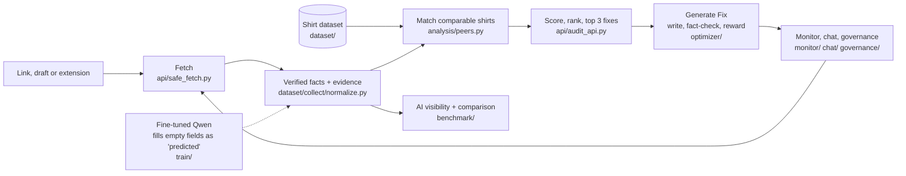

<div align="center">

# Aparece

**See your product page the way AI shopping assistants do, and fix what they can't read.**

[](https://github.com/1n1t6Sh3ll/powerlens/actions/workflows/ci.yml)
[](LICENSE)


[](https://github.com/1n1t6Sh3ll/powerlens/pkgs/container/aparece)

</div>

Shoppers now ask AI what to buy. We asked gpt-4o-mini and Claude Haiku 384 real shopping questions, in English and Spanish. None of the 103 small shirt shops we tested was named; Everlane, Uniqlo and Patagonia were. Paste a product link and Aparece shows what machines can read on your page, ranks it against comparable shirts, and gives you the 3 fixes to make first. Suggested text states only what your page proves, and you approve everything.

> The product was called ProductLens until recently. The repository, some environment variables (`PRODUCTLENS_*`) and a few internal names still use the old name.

## Features

- **Audit**: paste a link or a draft. Every fact shown comes with the exact text it was read from. Missing values stay missing.
- **Rank and fixes**: a fixed, visible formula (no AI) ranks the page among comparable shirts and lists the top 3 fixes, each with evidence.
- **Generate Fix**: writes a title and description from your verified facts, fact-checks every sentence, scores candidates with a reward, and only a fully passing candidate can win.
- **AI visibility**: real AI answers to shopping questions, showing which shops and brands get named and whether the claims match the facts.
- **AI comparison**: your original text vs Aparece (also with grounded shopper keywords added, for any link you paste) vs AI models, all written from the same facts.
- **Monitoring and chat**: snapshots, change events, and a chat that may only cite stored records.
- **Governance and webhooks**: approvals, an append-only audit log, signed webhooks. English and Spanish UI, plus a Chrome extension.

## Architecture



A FastAPI service (`api/main.py`) exposes the `/v1` routes and serves the React build in `web/` at `/`. Every stage, with its code, is in [docs/ARCHITECTURE.md](docs/ARCHITECTURE.md).

## How it works

1. **Fetch and read.** `api/safe_fetch.py` downloads the public page (private addresses are refused). Facts are read from the page markup and text with rules; every fact keeps the exact text it came from. A fine-tuned Qwen model can fill gaps, marked as *predicted*. Missing stays missing.
2. **Rank.** The page is matched with comparable shirts (`analysis/peers.py`) and scored by a fixed, visible formula (facts stated, description quality, structured data). No AI in the score. It lists the 3 fixes that matter most, each with evidence. Without the dataset there are no peers, so the position reads "1 of 1".
3. **Generate Fix.** `optimizer/` writes a title and description from the verified facts only. `optimizer/guard.py` checks every sentence: a word or number the facts do not support is flagged, and only a fully passing candidate can win.
4. **AI comparison.** Five writers get the same facts: the shop's original text, Aparece (no model), Aparece + GPT-4o-mini, GPT-4o-mini alone, and Claude Haiku alone. Each part is fact-checked, then scored (title, tags, description). `POST /v1/shootout/live` (the *Compare with AI* button) does this for any audited page, live, with a spend cap. The committed benchmark run adds a simulated shopping test.
5. **AI visibility.** `benchmark/` asks AI assistants real shopping questions and records which shops and brands they name, and whether their claims match the facts.
6. **Model ranking against ground truth.** `train/api_eval.py` and `train/eval.py` score every model on the same 200 labelled products (exact match per field), so the Qwen fine-tunes, GPT-4.1, Claude and the rest are compared on one scale.
7. **Keywords.** Shared keywords (product type, material, fit, neckline, sleeve, weight, colour) are the facts shoppers and assistants both use. Aparece only writes a keyword into a title or description when the page proves it.
8. **Over time.** `monitor/` snapshots pages and reports changes, `chat/` answers only from stored records, `governance/` and `webhooks/` add approvals and signed events.

Full detail with the code for each part: [docs/HOW_IT_WORKS.md](docs/HOW_IT_WORKS.md) and [docs/ARCHITECTURE.md](docs/ARCHITECTURE.md).

### The rank formula

Listing quality is a fixed formula with no AI (`api/audit_api.py`: `weights`, `quality`, `rank`):

```
score = 60 x (key facts stated / 22)
      + 20 x (shopper questions the description answers / 9)
      + 20 x (schema.org Product and Offer markup found / 2)
```

Facts are counted only when the page states them. A description question counts once, only when a sentence answers it and matches a verified fact; keyword lists and repeated text do not count. The page is ranked among up to 24 comparable shirts (same product type, language, audience and sleeve length, price within 30%). Ties share a position. If structured data is unknown for any shirt in the group, that part is dropped for everyone and the other weights are rescaled to 100 (75 / 25). It ranks listing completeness only; it is not an AI-visibility or search rank.

### Where the AI and the recommendations live

| What | Files | AI or rules |
|---|---|---|
| Reading page facts | `dataset/collect/normalize.py`, `extract.py` | Rules, with evidence |
| Filling empty fields | `api/model_backend.py`; training in `train/train.py` (QLoRA on Qwen), scoring in `train/eval.py`, `train/api_eval.py`, `train/reward.py` | **AI**: fine-tuned Qwen, optional (`MODEL_BACKEND=qwen`) |
| Rank and top 3 fixes (the recommendation system) | `api/audit_api.py` (`rank`, `build_actions`), `analysis/gaps.py`, `analysis/peers.py` | Rules: compares the page with its peers and lists what most of them state and it does not |
| Writing title and description | `optimizer/fix.py`, `optimizer/llm.py`, `optimizer/truth.py` | **AI** writer (`OPTIMIZER_BACKEND`: `stub` by default, or OpenAI, Anthropic, Qwen) |
| Fact-check of every sentence | `optimizer/guard.py` | Rules: blocks any word or number the facts do not support |
| AI comparison and visibility | `benchmark/shootout/`, `benchmark/harness.py` | Calls GPT and Claude, then scores with rules |
| Merchant chat | `chat/engine.py` | LLM (`CHAT_LLM`, `stub` by default), answers only from stored records |

So the ranking and the fix recommendations are transparent rules. The AI parts are the Qwen field filler and the copy writer, and both are checked by rules before anything is shown.

### The web app

`web/src/App.tsx` maps each address to a page (all under `#/`):

| Address | Page | File |
|---|---|---|
| `#/` | Landing, then the overview once signed in | `components/Home.tsx` |
| `#/audit`, `#/report/<id>` | Audit a link or draft and read the result, rank and fixes | `components/AuditPage.tsx`, `Results.tsx`, `FixPanel.tsx` |
| `#/bulk` | Audit many links at once | `components/BulkPage.tsx` |
| `#/products`, `#/products/<id>` | Saved products, monitoring and history | `components/ProductDetail.tsx`, `Monitor.tsx` |
| `#/compare/<id>` | AI comparison, saved or live | `pages/AiComparison.tsx` |
| `#/models` | Model ranking against ground truth | `components/ModelsPage.tsx` |
| `#/reports`, `#/share/<id>` | Reports and shareable results | `components/Report.tsx` |
| `#/chat` | Merchant chat | `components/Chat.tsx` |
| `#/docs`, `#/settings`, `#/onboarding`, `#/signin` | Help, settings, first run, sign-in | `pages/DocsPage.tsx`, `Settings.tsx`, `Onboarding.tsx` |

English and Spanish strings are in `web/src/i18n/`.

## Quickstart

Docker (published image):

```sh
docker run -p 8000:8000 ghcr.io/1n1t6sh3ll/aparece:latest
```

Or build locally with `docker compose up --build`. Or from source (Python 3.12+, Node 22; no API keys needed):

```sh
git clone https://github.com/1n1t6Sh3ll/powerlens.git && cd powerlens
./run.sh --skip-tests        # Windows: .\run.ps1 -SkipTests
```

`run.sh` creates `.venv`, installs `api/requirements.txt`, builds `web/`, and starts the API. Open http://127.0.0.1:8000 (API docs at `/docs`, health at `/v1/health`). Without the dataset, ranking against real shirts is unavailable; set `PRODUCTLENS_DATA` to a built dataset (see [docs/DATASET_SPEC.md](docs/DATASET_SPEC.md)).

### Run the whole project, including live AI comparison

1. **Start the app** with `./run.sh --skip-tests` (Windows: `.\run.ps1 -SkipTests`), or Docker as above. Open http://127.0.0.1:8000. Check `http://127.0.0.1:8000/v1/health` returns `{"status":"ok"}`. Change the port with `PORT=8001`.
2. **Audit a product:** paste a public product link on the home page. You get the facts with evidence, the rank, and the top 3 fixes. Click *Generate Fix* for a checked title and description.
3. **Turn on live AI comparison** (optional, paid): copy `.env.example` to `.env`, uncomment `OPENAI_API_KEY` and/or `ANTHROPIC_API_KEY`, and restart. `run.sh` then installs the provider packages (`benchmark/requirements.txt`) itself. Without a key, only the free writers run; the paid ones are skipped and the page says so.
   - Spending is capped: `SHOOTOUT_LIVE_MAX_USD` per request (default `0.05`) and `SHOOTOUT_LIVE_DAILY_USD` per server run (default `1`). One product costs about a tenth of a cent to a few tenths of a cent.
   - In the site, audit a page, then click *Compare with AI*. Or call `POST /v1/shootout/live` with `{"product": <record from POST /v1/audits>, "language": "en"}`.
4. **Compare many real pages:** with the server running, `python -m benchmark.shootout.live_batch run --out results.json --max-usd 0.5`, then `python -m benchmark.shootout.live_batch report results.json`. The run committed here is in [`benchmark/results/live-real-2026-09-30`](benchmark/results/live-real-2026-09-30/report.md).
5. **Score models against ground truth:** `python train/api_eval.py --data dataset/output/final_v2_2k/test_gold.jsonl --models openai:gpt-4o-mini --max-usd 1 --dry-run` prints the cost first; drop `--dry-run` to run. Paid runs refuse to start without `--max-usd`.
6. **Run the checks:** the commands under *Tests and build* below.

If something looks wrong: *"not in the comparison set"* means the page could not find the audited record; open *Compare with AI* from the audit result. *Position "1 of 1"* means no peer dataset is loaded (`PRODUCTLENS_DATA`). A paid writer showing an error usually means a missing or empty-credit key.

## Configuration

All optional; copy `.env.example` to `.env` (never commit it). The full list is in [docs/REFERENCE.md](docs/REFERENCE.md).

| Variable | Purpose |
|---|---|
| `PRODUCTLENS_DATA`, `_SIGNALS`, `_VISIBILITY`, `_EVAL` | Dataset and report files behind the audit |
| `MODEL_BACKEND`, `QWEN_ADAPTER_PATH` | `rules` (default) or the optional Qwen fallback |
| `OPTIMIZER_BACKEND`, `OPTIMIZER_MODEL` | Generate Fix writer (`stub` default) |
| `ANTHROPIC_API_KEY`, `OPENAI_API_KEY` | Paid runs only; they also need a spend cap (`--max-usd`, `BENCHMARK_MAX_USD`) |
| `MONITOR_ENABLED`, `MONITOR_DB` | Monitoring scheduler and snapshot store |
| `GOVERNANCE_TOKEN`, `GOVERNANCE_ADMIN_TOKEN` | Enable approvals; admin view of the audit log |
| `CHAT_TOKEN`, `CHAT_LLM` | Protect `/v1/chat`; chat backend (`stub` default) |

## Tests and build

Offline, with no network or paid calls:

```sh
python -m unittest discover -s api/tests
python -m unittest discover -s analysis/tests -t .
python -m unittest discover -s benchmark/tests -t .
python -m unittest discover -s signals/tests -t .
python -m unittest discover -s dataset/tests
python -m unittest discover -s tools/linkcheck/tests -t .
python -m unittest discover -s train/tests
cd web && npm ci && npm test && npm run build
```

CI (`.github/workflows/ci.yml`) runs these on every pull request.

## Results

**Model ranking: reading product pages** (200 products, 63 stores, same input for every system; share of filled fields that exactly match the label):

| # | System | Accuracy |
|---|---|---|
| 1 | Aparece Qwen2.5-0.5B, fine-tuned | **85.8%** |
| 2 | Aparece Qwen2.5-1.5B, fine-tuned (16k shirts) | 81.2% |
| 3 | GPT-4.1 | 27.2% |
| 4 | Claude Sonnet 5.5 (answered 87 of 200 only, not comparable) | 8.1% |
| 5 | Qwen2.5-0.5B, no fine-tuning | 4.7% |

Scored on our own label format, which favours the fine-tuned models. These figures come from a local run (`train/runs/comparison.json`, not committed); see [docs/HOW_IT_WORKS.md](docs/HOW_IT_WORKS.md).

**Comparison on real product pages** ([`benchmark/results/live-real-2026-09-30`](benchmark/results/live-real-2026-09-30/report.md)): 25 pages fetched live, 22 with enough facts, total cost $0.04. Each version is fact-checked against the page's own verified facts.

| Version | Passed fact check | Flagged sentences |
|---|---|---|
| Aparece (no AI model) | **22 / 22** | 0 |
| Aparece + GPT-4o-mini | **22 / 22** | 0 |
| Shop's original text | 1 / 22 | 417 |
| GPT-4o-mini alone | 0 / 22 | 82 |
| Claude Haiku 4.5 alone | 0 / 21 | 75 |

Aparece won the description on all 22 pages, the title on 19 and the tags on 18. Flagged sentences are claims the page's facts do not support, such as "vibrant" or "perfect for casual wear". Repeat it with `python -m benchmark.shootout.live_batch run --out <file> --max-usd 0.5` (needs a running API and API keys). Three pages could not be fetched (400, 404, 502). Position "1 of 1" in the run is not a ranking, because that machine had no peer dataset.

**Other tests**: the 5-product copy test (`benchmark/shootout/results/2026-09-29`) found no decisive visibility gap (interval includes 0). In 384 AI shopping answers (`benchmark/results/visibility-2026-09-30`), none of 103 small shops was named; Everlane, Uniqlo and Patagonia were.

Caveats: the checks measure facts and listing quality, not how a real assistant will rank your page. Judges in the copy test are also AI models, and its context is simulated.

## Project layout

| Path | Contents |
|---|---|
| `api/` | FastAPI app, audit, safe fetch, tests |
| `web/` | React + Vite site (EN/ES) |
| `extension/` | Chrome MV3 extension |
| `dataset/`, `analysis/`, `signals/` | Data collection and normalizing, peer matching, signals |
| `optimizer/`, `train/` | Generate Fix, fact-check, reward, Qwen training and eval |
| `benchmark/` | AI visibility harness, hallucination check, AI comparison |
| `monitor/`, `chat/`, `experiments/`, `governance/`, `webhooks/` | Over-time and control features |
| `docs/` | Documentation |

## Docs

[Architecture](docs/ARCHITECTURE.md) · [How it works](docs/HOW_IT_WORKS.md) · [Reference: setup, env, API routes](docs/REFERENCE.md) · [Vision](docs/VISION.md) · [Dataset spec](docs/DATASET_SPEC.md) · [Governance](docs/GOVERNANCE.md) · [Webhooks](docs/WEBHOOKS.md) · [User stories](docs/USER_STORIES.md). Model weights: [weights-v1 release](https://github.com/1n1t6Sh3ll/powerlens/releases/tag/weights-v1).

## License

Code: MIT ([LICENSE](LICENSE)). Data and weights are for research use.
