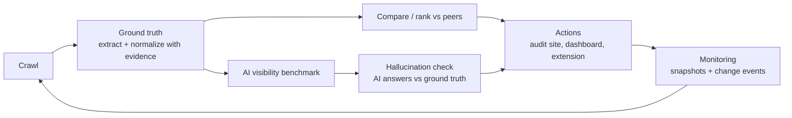

# ProductLens

ProductLens audits how a product page is understood by search and by AI assistants. It crawls a product page, extracts evidence-backed ground-truth attributes (every value points at an exact substring of the page), compares the product with comparable peers, measures whether AI models mention and cite it for realistic shopping prompts, and turns the gaps into labelled actions (observed fact, supported hypothesis, unknown) that a merchant can monitor over time. It is deterministic by default: no GPU, no paid API calls, and no composite "score". The first vertical is shirts/t-shirts in English and Spanish. Product vision: [docs/VISION.md](docs/VISION.md).

## Architecture



Stage-by-stage mapping to code: [docs/ARCHITECTURE.md](docs/ARCHITECTURE.md).

| Path | What |
|---|---|
| `web/` | Shirt audit site served at `/` (React + TypeScript + Vite): paste a URL or draft listing, get a listing-quality rank among comparable shirts (formula shown; not an AI or search rank), top 3 fixes, side-by-side peers, facts with evidence, price position, monitoring; EN/ES; bulk audit of up to 20 URLs with CSV export; Models page (`#/models`, `GET /v1/model-comparison` reads `PRODUCTLENS_COMPARISON`, default `train/runs/comparison.json`; empty state until the run lands) |
| `api/` | FastAPI service: `POST /v1/audit`, extraction, dashboard, monitoring and governance routes, OpenAPI at `/docs` |
| `governance/` | Action policy (`auto` / `approve` / `forbidden`, each with an owner), append-only audit log, approvals ([docs/GOVERNANCE.md](docs/GOVERNANCE.md)) |
| `dataset/` | Collectors (live fetch, WDC, Amazon Reviews 2023), normalization rules, ground-truth build ([spec](docs/DATASET_SPEC.md), [README](dataset/README.md)) |
| `analysis/` | Peer comparison and gap issues (no LLM) |
| `signals/` | Review and price signals |
| `benchmark/` | AI-visibility benchmark harness |
| `monitor/` | Scheduled crawls, snapshots, change events |
| `dashboard/`, `extension/` | Analyst dashboard (served at `/dashboard/`) and MV3 Chrome popup |
| `train/` | Optional Qwen2.5-1.5B QLoRA extractor (GPU; not needed to run the demo) |

## Quickstart

Docker (one command; audit site at http://127.0.0.1:8000/, dashboard at `/dashboard/`, API docs at `/docs`):

```sh
docker compose up --build
```

Without Docker (Python 3.12+; creates `.venv`, installs `api/requirements.txt`, runs the tests, starts the API on :8000):

```sh
./run.sh              # macOS/Linux/Git Bash
.\run.ps1             # Windows PowerShell
./run.sh --skip-tests # start faster
```

Demo with bundled fixtures (no downloads, no keys):

```sh
tools/demo_data.sh   # then open http://127.0.0.1:8000/dashboard/
```

Configuration: copy `.env.example` to `.env` and uncomment what you need. `run.sh`/`run.ps1` load it; `docker compose` reads it for variable substitution. Dashboard data paths (`PRODUCTLENS_DATA`, `PRODUCTLENS_SIGNALS`, `PRODUCTLENS_VISIBILITY`, `PRODUCTLENS_EVAL`) are optional; missing files give empty states. Never commit `.env`.

The audit site at `/` needs the `web/` build: Docker builds it; `run.sh`/`run.ps1` build it when `npm` is available (else `cd web && npm ci && npm run build`; dev server: `npm run dev`, proxies `/v1` to :8000). Without it the API and `/dashboard/` still work.

Main routes: `GET /v1/health`, `POST /v1/audit` (`{url}`, `{html|text}` or a draft `{title, text, price?, currency?, language?}`), `POST /v1/extract`, `GET /v1/products?q=`, `/v1/products/{id}/gaps`, `/v1/visibility`, `/v1/eval`, `POST /v1/enroll`, `GET /v1/governance/policy`, `GET /v1/audit-log`, `GET|POST /v1/approvals` (POST disabled unless `GOVERNANCE_TOKEN` is set). Details at `/docs`.

Optional model backend: `MODEL_BACKEND=qwen` with `pip install -r api/requirements-qwen.txt` and a LoRA adapter at `QWEN_ADAPTER_PATH` (base Qwen2.5-1.5B-Instruct; 4-bit on CUDA, else CPU). Rule facts with evidence stay primary; the model only fills fields the rules left null, returned separately as `predicted` with `model_status`, and falls back to rules on any error. The Docker image is rules-only.

## Tests

```sh
python -m unittest discover -s analysis/tests -t .
python -m unittest discover -s benchmark/tests -t .
python -m unittest discover -s signals/tests -t .
python -m unittest discover -s dataset/tests
python -m unittest discover -s api/tests
```

`run.sh` runs all five before starting the server. Tests use local fixtures and the `mock` model; they make no network or paid calls.

## AI-visibility benchmark (spend-capped)

```sh
# free: mock model
python -m benchmark.harness run --prompts benchmark/examples/prompts.example.jsonl \
  --models mock:mock-1 --catalog benchmark/examples/catalog.example.jsonl --out runs.jsonl
python -m benchmark.harness report --results runs.jsonl \
  --catalog benchmark/examples/catalog.example.jsonl --out-dir benchmark/reports/

# paid: always --dry-run first, then cap spend
python -m benchmark.harness run ... --models anthropic:<model> --dry-run
python -m benchmark.harness run ... --models anthropic:<model> --max-usd 5
```

- Keys come only from `ANTHROPIC_API_KEY` / `OPENAI_API_KEY`. Paid runs require `--max-usd` and a price in `benchmark/prices.json`; the harness stops at the cap.
- Local models: `qwen:<model>` against an OpenAI-compatible server at `QWEN_BASE_URL` (default Ollama).
- Prompt set: `benchmark/prompts/tshirts.jsonl` (120 brand-free intents, EN US/GB and ES ES/MX, seeded 60/20/20 split). `benchmark/prompts/hidden.jsonl` is the held-out split; optimizers must never read it.
- Scheduled weekly visibility (`MONITOR_ENABLED=1`) runs only when a key and `BENCHMARK_MAX_USD` are both set; otherwise it logs `skipped`.
- Hallucination check (`benchmark/claims.py`): `report` parses the sentences around each matched product with the `normalize.py` rules and labels each attribute claim SUPPORTED / CONTRADICTED / UNVERIFIABLE against that product's non-null ground truth. Per model/language it reports claim accuracy = supported/(supported+contradicted), hallucination rate = contradicted/(supported+contradicted), the unverifiable share (never counted wrong), and quoted examples with gold evidence.
- Metrics (mention rate, top-k, MRR, citation rate, stability) describe observed outputs of black-box systems, not their internals.
- `benchmark/metrics.py` also provides `competitor_win_rate(records, products, a, b)` (CWR: share of responses mentioning A or B where A ranks first), `language_visibility_gap(...)` (LVG = V_EN − V_ES per model/product) and `claim_accuracy_passthrough(claims_report)`.

## Competitor intelligence

`python -m analysis.competitor --data records.jsonl --product-id p_123 [--k 5] [--lvg 0.2]` ranks peers with `analysis.peers.similar_peers` (documented weights in `SIM_WEIGHTS`: category, subcategory, price band, attributes, use/style, market TLD+currency, language, title/description cosine via scikit-learn TF-IDF if installed, else token cosine; unknown components are skipped). It prints a table (attributes present, JSON-LD fields, verified facts, Spanish content none/partial/full, independent evidence or "not measured", entity consistency %, contradictions) versus the peer median and top peers, plus issues labelled OBSERVED_FACT / SUPPORTED_HYPOTHESIS / UNKNOWN. Spanish coverage is compared only with peers in the target's page language (a peer counts as Spanish only through its own Spanish page or Spanish text). The Spanish-coverage hypothesis is SUPPORTED only when a measured `--lvg` > 0 is given; otherwise it is UNKNOWN. Issues are measurable differences associated with the observed visibility gap, not causes.

## Results

No results are claimed in this README. Numbers appear only when the evaluation files exist in your checkout:

- Extraction eval: `train/runs/eval.json` (from `train/eval.py`), shown at `/dashboard/` (Models) and `GET /v1/eval`.
- AI visibility: `benchmark/reports/report.json` (from `benchmark.harness report`), shown at `/dashboard/` (AI visibility) and `GET /v1/visibility`.
- Dataset stats: `dataset/output/final/stats.json`.

These outputs are git-ignored or generated locally; the files under `api/tests/fixtures/` are test fixtures, not results.

## Data provenance and licensing

The code is MIT-licensed ([LICENSE](LICENSE)). Datasets are not redistributed in this repo (`dataset/output/` is git-ignored) and are for research use only.

| Source | Use | Terms |
|---|---|---|
| Live product pages (`dataset/collect/fetch.py`, `monitor/`) | Crawl and audit | robots.txt respected, 1 req/s per host, identifying User-Agent, no challenge bypass; page content stays with its owner |
| [Web Data Commons schema.org Product, 2024-12](https://data.dws.informatik.uni-mannheim.de/structureddata/2024-12/quads/classspecific/Product/) (Common Crawl, Oct 2024) | Training/eval records | Research use; underlying pages remain their owners' content |
| [Amazon Reviews 2023](https://amazon-reviews-2023.github.io/) (McAuley Lab) | Training volume, review signals | License not declared: research-only; every row carries `provenance.license = "undeclared-research-only"` so it can be excluded |
| ECB reference rates, BLS CPI-U | USD-2026 price normalization | Public statistics; sources in `signals/reference.py` |
| `Qwen/Qwen2.5-1.5B-Instruct` (optional) | Extraction fallback | Apache-2.0 per its model card |

Do not use the collected data commercially without checking each source's terms. No third-party code is copied into this repo (dependencies are installed from `requirements.txt` files), so there is no THIRD_PARTY_NOTICES.md; add one if code is copied later.

## Governance

Every action is `auto`, `approve` or `forbidden` with a named owner (account owner, merchant, ProductLens operator); decisions go to an append-only audit log (`GOVERNANCE_DB`). Paid benchmark runs need a key and a spend cap; optimizers never read the hidden prompt split. Full policy: [docs/GOVERNANCE.md](docs/GOVERNANCE.md). Task board and decisions: `coordination/`.

## Checks and merging

CI (`ci / check`) runs `dataset/tests`, compiles `train/`, and runs `api/tests`. PR only: `main` requires the `check` status and 1 approval (repo admins can bypass the approval on PR merge). Every merge also needs independent review, updated docs, and explicit human approval of the exact revision.

## Team and credits

Built by [1n1t6sh3ll](https://github.com/1n1t6Sh3ll) with AI coding agents (Claude, Codex) working through a shared task board with independent review. Thanks to the Web Data Commons team (University of Mannheim), Common Crawl, the McAuley Lab (UCSD) for Amazon Reviews 2023, and the Qwen team.
