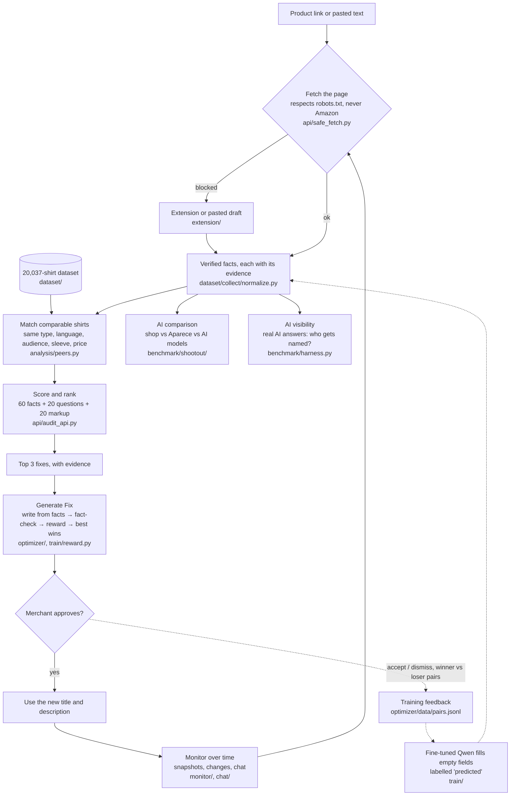

# Aparece

**See your product page the way AI shopping assistants do, and fix what they can't read.**

Shoppers now ask AI what to buy. We asked gpt-4o-mini and Claude Haiku 384 real shopping questions, in English and Spanish. None of the 103 small shirt shops we tested was named; Everlane, Uniqlo and Patagonia were. Paste your product link, and Aparece shows what machines can read on your page, ranks it against similar shirts, and gives you the 3 fixes to make first. It suggests text that only states what your page proves; you approve everything.

## Try it

```sh
docker run -p 8000:8000 ghcr.io/1n1t6sh3ll/aparece:latest
```

Open http://127.0.0.1:8000 and paste a product link. To run from source: `git clone https://github.com/1n1t6Sh3ll/powerlens.git && cd powerlens && ./run.sh` (Windows: `.\run.ps1`). You need Python 3.12+ and Node 22, and no API keys. To rank against real shirts, set `PRODUCTLENS_DATA` to the dataset (build it with `dataset/collect/wdc.py` → `dataset/build/make_ground_truth.py`). The model weights are in the [weights-v1 release](https://github.com/1n1t6Sh3ll/powerlens/releases/tag/weights-v1).

## How it works



**The key formulas**

```
listing score = 60 × (key facts stated ÷ 22) + 20 × (shopper questions answered ÷ 9) + 20 × (markup found ÷ 2)
rank          = 1 + number of comparable shirts with a higher score
reward        = 1 + share of sentences passing the fact-check − 2 × flagged sentences + 2 × share of facts covered
```

**The reward mechanism** (`train/reward.py` → `copy_reward`, used by `optimizer/fix.py`):
1. The writer produces 3 candidate titles and descriptions from your verified facts only.
2. Every sentence goes through the fact-check.
3. Each candidate gets a reward:
   - **+1** for a valid format (a title of up to 90 characters, plus a description); a broken format scores **−10**;
   - **up to +1** for the share of its sentences that pass the fact-check;
   - **−2** for every flagged sentence;
   - **up to +2** for the share of your verified facts it mentions.
4. **A candidate with any flagged sentence can't win**, whatever its reward. If none passes, the writer gets the flagged sentences back and tries again, up to 2 more rounds. After that, unsupported sentences are removed. If nothing is left, the plain fact sentences are used.
5. The winner is the passing candidate with the highest reward. Each winner and a lower-scoring candidate are saved as a pair (`optimizer/data/pairs.jsonl`), as future training data.

Example: 5 sentences, all passing, mentioning 6 of 8 facts: 1 + 1 + 0 + 1.5 = **3.5**. The same candidate with 1 flagged sentence: 1 + 0.8 − 2 + 1.5 = **1.3**, and it can't win.

The fact-check rejects any word or number that your page's facts don't back (`optimizer/guard.py`). In the AI comparison, only parts that pass can win: the best title score, the best tag score, and the best description (most AI mentions, or the most facts covered).

## Results

| Test (same input for every model) | Result |
|---|---|
| Reading product pages (200 products, 63 stores) | Aparece Qwen2.5-0.5B **85.8%** · GPT-4.1 27.2% · untuned Qwen 4.7% |
| Writing product copy | Aparece best on title, tags and description with no unsupported claims; visibility a statistical tie |
| Which shops AI names (384 questions) | 0% for the 103 small shops; big brands named instead |

Caveats: the extraction test uses our own label format, and the copy-test judges are also AI models. Human feedback is being collected (label reviews, confirmed predictions, accepted fixes, text pairs), but the model hasn't been retrained on it yet.

## Learn more

[How it works](docs/HOW_IT_WORKS.md) covers every formula, where it is in the code, tags, the human loop and the vision. The [Reference](docs/REFERENCE.md) lists all settings and API routes, and there's a [Vision](docs/VISION.md) document. Tests: `python -m unittest discover -s api/tests` and `cd web && npm test` (offline, no paid calls). The code is MIT-licensed; the data and weights are for research use.
