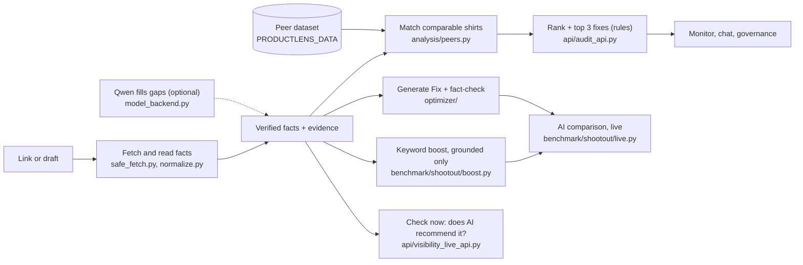

<div align="center">

# Aparece

**See your product page the way AI shopping assistants do, and fix what they can't read.**

[](https://github.com/1n1t6Sh3ll/powerlens/actions/workflows/ci.yml)
[](LICENSE)


[](https://github.com/1n1t6Sh3ll/powerlens/pkgs/container/aparece)

</div>

**Live app: [aparece.fly.dev](https://aparece.fly.dev/)** (hosted on Fly.io). Some shops block cloud servers, so if a link cannot be read there, paste the page text as a draft instead.

Shoppers now ask AI what to buy. We asked four AI models 768 real shopping questions: none of the 103 small shirt shops we tested was named; Uniqlo, Patagonia and Everlane were. Paste a product link and Aparece shows what machines can read on your page, ranks it against comparable shirts, lists the 3 fixes to make first, and can check on request whether AI assistants recommend it. Suggested text states only what your page proves, and you approve everything.

> Formerly ProductLens: the repository and some settings (`PRODUCTLENS_*`) keep the old name.

## What it does

- **Audit**: every fact comes with the exact text it was read from; missing stays missing.
- **Rank and fixes**: a fixed formula (no AI) ranks the page among comparable shirts and lists the top 3 fixes.
- **Generate Fix**: writes a title and description from verified facts; every sentence is fact-checked.
- **AI comparison**: your text vs Aparece (with grounded keywords) vs GPT and Claude, for any link.
- **Check now**: asks GPT and Claude shopping questions and reports whether your product was named.
- **Also**: monitoring, grounded chat, approvals, webhooks, EN/ES UI, Chrome extension.

## How it works



**Rank formula** (`api/audit_api.py`, no AI): `score = 60 x (facts stated / 22) + 20 x (shopper questions the description answers / 9) + 20 x (schema.org Product and Offer markup / 2)`. Ranked among up to 24 shirts of the same type, language, audience and sleeve, price within 30%. If structured data is unknown for any of them, weights become 75 / 25. It ranks listing completeness, not AI visibility.

### Where the AI and the recommendations live

| What | Files | AI or rules |
|---|---|---|
| Reading facts | `dataset/collect/normalize.py` | Rules, with evidence |
| Filling empty fields | `api/model_backend.py`, `train/` (QLoRA on Qwen) | **AI**, optional (`MODEL_BACKEND=qwen`) |
| Rank and top 3 fixes (the recommendations) | `api/audit_api.py`, `analysis/gaps.py`, `analysis/peers.py` | Rules: what most peers state and this page does not |
| Title and description writer | `optimizer/fix.py`, `optimizer/llm.py` | **AI** (`OPTIMIZER_BACKEND`, `stub` by default) |
| Fact-check of every sentence | `optimizer/guard.py` | Rules |
| Keyword boost | `benchmark/shootout/boost.py` | Rules, only facts the page proves |
| AI comparison, visibility, Check now | `benchmark/`, `api/visibility_live_api.py` | Calls GPT and Claude, scores with rules |
| Model ranking vs ground truth | `train/api_eval.py`, `train/eval.py` | Scores every model on the same 200 labelled products |
| Chat | `chat/engine.py` | LLM (`CHAT_LLM`, `stub` by default), stored records only |

The recommendation system is transparent rules. The AI parts (Qwen, the writer, chat) are always checked by rules before anything is shown. Detail: [How it works](docs/HOW_IT_WORKS.md), [Architecture](docs/ARCHITECTURE.md).

### The web app

Pages live under `web/src/` and are routed in `App.tsx`: `#/audit` and `#/report/<id>` (`Results.tsx`), `#/bulk`, `#/products` (`ProductDetail.tsx`), `#/compare/<id>` (`pages/AiComparison.tsx`), `#/models`, `#/reports`, `#/chat`, `#/docs` ("How it works", `pages/DocsPage.tsx`), `#/settings`. Dark theme by default; strings in `web/src/i18n/`.

## Run it

```sh
docker run -p 8000:8000 ghcr.io/1n1t6sh3ll/aparece:latest        # or: docker compose up --build
git clone https://github.com/1n1t6Sh3ll/powerlens.git && cd powerlens
./run.sh --skip-tests        # Windows: .\run.ps1 -SkipTests   (Python 3.12+, Node 22)
```

Open http://127.0.0.1:8000 (API docs `/docs`, health `/v1/health`, port via `PORT`). `run.sh` builds the venv and the web app, and rebuilds the web app when `web/src` changes.

- **Peer data is needed for rank, similar products and fixes.** Without it the page shows "1 of 1" and no fixes. Download the peer file from the [peers-v1 release](https://github.com/1n1t6Sh3ll/powerlens/releases/tag/peers-v1) (11,964 shirts, 4.5 MB gzipped, research use): `gh release download peers-v1 --pattern peers.jsonl.gz && gunzip peers.jsonl.gz`, then set `PRODUCTLENS_DATA=peers.jsonl` (default path `dataset/output/final/train.jsonl`, not in git; see the [dataset spec](docs/DATASET_SPEC.md)).
- **Paid features are optional.** Put `OPENAI_API_KEY` and/or `ANTHROPIC_API_KEY` in `.env` (copy `.env.example`); `run.sh` then installs the provider packages. Without keys the free writers run and paid ones are skipped.
- **Spend caps:** *Compare with AI* `SHOOTOUT_LIVE_MAX_USD` 0.05 per request and `SHOOTOUT_LIVE_DAILY_USD` 1 per day; *Check now* `VISIBILITY_LIVE_MAX_USD` 0.05, `VISIBILITY_LIVE_DAILY_USD` 1, `VISIBILITY_LIVE_RATE_LIMIT` 3/min, results cached 24 h. A product costs about a cent. Batch runs need `--max-usd`.
- **Batch tools:** `python -m benchmark.shootout.live_batch run --out r.json --max-usd 0.5` (many real pages); `python train/api_eval.py --data dataset/output/final_v2_2k/test_gold.jsonl --models openai:gpt-4o-mini --max-usd 1 --dry-run` (models vs ground truth).
- **If something looks wrong:** "not in the comparison set" means open *Compare with AI* from the audit result; a paid writer error usually means a missing or empty-credit key.

Other settings: `MODEL_BACKEND`/`QWEN_ADAPTER_PATH`, `OPTIMIZER_BACKEND`, `MONITOR_ENABLED`, `GOVERNANCE_TOKEN`, `CHAT_TOKEN`; full list in [docs/REFERENCE.md](docs/REFERENCE.md).

## Deploy (Fly.io)

```sh
fly auth login
fly launch --copy-config --no-deploy      # uses fly.toml; pick a free app name and a region
fly volumes create data --size 3 --region iad             # once, before the first deploy
fly secrets set OPENAI_API_KEY=... ANTHROPIC_API_KEY=...    # optional, enables the paid features
fly deploy --ha=false                     # one machine: a volume attaches to a single machine
```

In PowerShell you can pass keys from your environment without typing them: `fly secrets set OPENAI_API_KEY=$env:OPENAI_API_KEY ANTHROPIC_API_KEY=$env:ANTHROPIC_API_KEY`. The image (built from `Dockerfile`) includes the OpenAI and Anthropic packages; `docker-compose.yml` passes the same keys and caps to a local container.

- **Keys** live only in the host's secrets, never in git and never in a website's public environment (for example a Vercel `VITE_` variable). Use dedicated keys with a monthly spend limit set at OpenAI and Anthropic.
- **The paid routes have no login.** Anyone who can reach the site can spend up to the caps (0.05 USD per request, 1 USD per day per running server) at a limited rate. Put the site behind your host's password protection or a proxy if it is public.
- **State and peer data live on a volume.** `fly.toml` mounts a volume named `data` at `/data` and points `PROFILE_DB`, `MONITOR_DB`, `GOVERNANCE_DB`, `WEBHOOKS_DB`, `EXPERIMENTS_DB` and `PRODUCTLENS_DATA` (`/data/peers.jsonl`) there, so stored audits, share links, monitoring, governance and webhooks survive restarts and deploys. Create the volume once, before the first deploy of this config: `fly volumes create data --size 3 --region iad`. The image starts as root only to `chown` `/data`, then runs the app as user `app`.
- **Peer data is not in git or in the image.** Upload it once (get `peers.jsonl` from the release above): `fly ssh sftp put peers.jsonl /data/peers.jsonl`, (the app reloads the file when it changes; a `fly machine restart <id>` is optional). Without the file audits still work but rank "1 of 1" and list no fixes.
- **Fly's free trial stops machines after 5 minutes.** For an always-on app, add a credit card at https://fly.io/trial.
- **One machine only.** A volume attaches to a single machine in one region; do not scale beyond one machine with this config (it also keeps the in-memory spend caps meaningful). Volumes are not replicated automatically: take snapshots (`fly volumes snapshots list`) if the data matters.
- **Vercel** can host only the web app (`web/`), with `/v1/*` rewritten to the API. The API needs a long-running host (slow requests, SQLite, in-memory caps).

## Tests

```sh
for s in api/tests "analysis/tests -t ." "benchmark/tests -t ." "signals/tests -t ." dataset/tests "tools/linkcheck/tests -t ." train/tests; do python -m unittest discover -s $s; done
cd web && npm ci && npm test && npm run build
```

All offline, no paid calls. CI runs the Python suites and the web build (not `npm test`) on every pull request.

## Results

**Reading product pages** (200 products, 63 stores; share of filled fields that exactly match the label):

| # | System | Accuracy |
|---|---|---|
| 1 | Aparece Qwen2.5-0.5B, fine-tuned | **85.8%** |
| 2 | Aparece Qwen2.5-1.5B, fine-tuned | 81.2% |
| 3 | GPT-4.1 | 27.2% |
| 4 | Claude Sonnet 5.5 (87 of 200 only) | 8.1% |
| 5 | GPT-4o-mini | 6.2% |
| 6 | Qwen2.5-0.5B, no fine-tuning | 4.7% |
| 7 | Claude Haiku 4.5 | 3.7% |

Scored on our own label format, which favours the fine-tuned models. From a local run (`train/runs/comparison.json`, not committed).

**Copy written for 22 real pages** ([report](benchmark/results/live-real-2026-09-30/report.md), $0.04): passed the fact check: Aparece **22/22**, Aparece + GPT-4o-mini **22/22**, shop's original 1/22, GPT-4o-mini alone 0/22, Claude Haiku alone 0/21. Aparece won the description on all 22, the title on 19, the tags on 18. Keyword boost on the same pages: title score 0.894 to 0.924, description intent coverage 0.016 to 0.061, fact check still passing (`benchmark/results/keyword-boost-2026-09-30.json`).

**Which shops AI names** (`benchmark/results/visibility-2026-09-30*`): 4 models (Claude Haiku 4.5, GPT-4o-mini, GPT-4.1-mini, GPT-4.1-nano), 768 answers: **0 of 103 small shops named**; named instead: Uniqlo 174, Patagonia 133, Everlane 131, Nike 109, H&M 93.

Caveats: these check facts and listing quality, not how a real assistant will rank your page. The copy-test judges are AI models and its shopping context is simulated. Small samples.

## Layout and docs

`api/` FastAPI · `web/` React + Vite · `extension/` Chrome MV3 · `dataset/` `analysis/` `signals/` data and peers · `optimizer/` `train/` writer, fact-check, Qwen · `benchmark/` visibility and comparison · `monitor/` `chat/` `governance/` `webhooks/` `experiments/` over time · `docs/`.

[Architecture](docs/ARCHITECTURE.md) · [How it works](docs/HOW_IT_WORKS.md) · [Reference](docs/REFERENCE.md) · [Vision](docs/VISION.md) · [Dataset spec](docs/DATASET_SPEC.md) · [Governance](docs/GOVERNANCE.md) · [Webhooks](docs/WEBHOOKS.md) · [User stories](docs/USER_STORIES.md) · [Model weights](https://github.com/1n1t6Sh3ll/powerlens/releases/tag/weights-v1)

## AI and tech, briefly

- **Stack:** Python 3.12 with FastAPI and uvicorn, SQLite for state, APScheduler for monitoring. Web app in React 19, TypeScript, Vite and Tailwind 4. Chrome extension (Manifest V3). Docker image, deployed on Fly.io. GitHub Actions for CI.
- **Rules first.** Facts are read with rules, and every fact keeps its evidence. The rank formula, the fix recommendations, the fact-check of every written sentence and the keyword boost are all deterministic rules, not AI.
- **Small fine-tuned model (optional).** Qwen2.5-0.5B and 1.5B, fine-tuned with QLoRA (PEFT, TRL, bitsandbytes) to read a product page into a fixed set of fields. It only fills fields the rules left empty, marked as *predicted*, and never overrides a rule fact. Off by default (`MODEL_BACKEND=qwen` turns it on).
- **Hosted models, used in three roles:** writers (GPT-4o-mini, Claude Haiku, Qwen) for titles and descriptions, always behind the fact-check; the shopping assistants we measure in the visibility runs and *Check now*; and judges in the copy comparison. Paid calls need your keys and stay under spend caps.

License: MIT ([LICENSE](LICENSE)). Data and weights are for research use.
