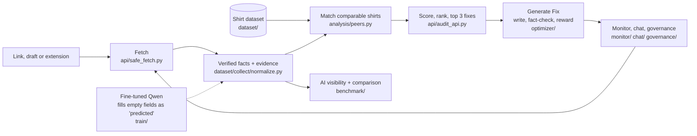

<div align="center">

# Aparece

**See your product page the way AI shopping assistants do, and fix what they can't read.**

[](https://github.com/1n1t6Sh3ll/powerlens/actions/workflows/ci.yml)
[](LICENSE)


[](https://github.com/1n1t6Sh3ll/powerlens/pkgs/container/aparece)

</div>

Shoppers now ask AI what to buy. We asked gpt-4o-mini and Claude Haiku 384 real shopping questions, in English and Spanish. None of the 103 small shirt shops we tested was named; Everlane, Uniqlo and Patagonia were. Paste a product link and Aparece shows what machines can read on your page, ranks it against comparable shirts, and gives you the 3 fixes to make first. Suggested text states only what your page proves, and you approve everything.

> The product was called ProductLens until recently. The repository, some environment variables (`PRODUCTLENS_*`) and a few internal names still use the old name.

## Features

- **Audit**: paste a link or a draft. Every fact shown comes with the exact text it was read from. Missing values stay missing.
- **Rank and fixes**: a fixed, visible formula (no AI) ranks the page among comparable shirts and lists the top 3 fixes, each with evidence.
- **Generate Fix**: writes a title and description from your verified facts, fact-checks every sentence, scores candidates with a reward, and only a fully passing candidate can win.
- **AI visibility**: real AI answers to shopping questions, showing which shops and brands get named and whether the claims match the facts.
- **AI comparison**: your original text vs Aparece (also with grounded shopper keywords added, for any link you paste) vs AI models, all written from the same facts.
- **Monitoring and chat**: snapshots, change events, and a chat that may only cite stored records.
- **Governance and webhooks**: approvals, an append-only audit log, signed webhooks. English and Spanish UI, plus a Chrome extension.

## Architecture



A FastAPI service (`api/main.py`) exposes the `/v1` routes and serves the React build in `web/` at `/`. Every stage, with its code, is in [docs/ARCHITECTURE.md](docs/ARCHITECTURE.md).

## Quickstart

Docker (published image):

```sh
docker run -p 8000:8000 ghcr.io/1n1t6sh3ll/aparece:latest
```

Or build locally with `docker compose up --build`. Or from source (Python 3.12+, Node 22; no API keys needed):

```sh
git clone https://github.com/1n1t6Sh3ll/powerlens.git && cd powerlens
./run.sh --skip-tests        # Windows: .\run.ps1 -SkipTests
```

`run.sh` creates `.venv`, installs `api/requirements.txt`, builds `web/`, and starts the API. Open http://127.0.0.1:8000 (API docs at `/docs`, health at `/v1/health`). Without the dataset, ranking against real shirts is unavailable; set `PRODUCTLENS_DATA` to a built dataset (see [docs/DATASET_SPEC.md](docs/DATASET_SPEC.md)).

## Configuration

All optional; copy `.env.example` to `.env` (never commit it). The full list is in [docs/REFERENCE.md](docs/REFERENCE.md).

| Variable | Purpose |
|---|---|
| `PRODUCTLENS_DATA`, `_SIGNALS`, `_VISIBILITY`, `_EVAL` | Dataset and report files behind the audit |
| `MODEL_BACKEND`, `QWEN_ADAPTER_PATH` | `rules` (default) or the optional Qwen fallback |
| `OPTIMIZER_BACKEND`, `OPTIMIZER_MODEL` | Generate Fix writer (`stub` default) |
| `ANTHROPIC_API_KEY`, `OPENAI_API_KEY` | Paid runs only; they also need a spend cap (`--max-usd`, `BENCHMARK_MAX_USD`) |
| `MONITOR_ENABLED`, `MONITOR_DB` | Monitoring scheduler and snapshot store |
| `GOVERNANCE_TOKEN`, `GOVERNANCE_ADMIN_TOKEN` | Enable approvals; admin view of the audit log |
| `CHAT_TOKEN`, `CHAT_LLM` | Protect `/v1/chat`; chat backend (`stub` default) |

## Tests and build

Offline, with no network or paid calls:

```sh
python -m unittest discover -s api/tests
python -m unittest discover -s analysis/tests -t .
python -m unittest discover -s benchmark/tests -t .
python -m unittest discover -s signals/tests -t .
python -m unittest discover -s dataset/tests
python -m unittest discover -s tools/linkcheck/tests -t .
python -m unittest discover -s train/tests
cd web && npm ci && npm test && npm run build
```

CI (`.github/workflows/ci.yml`) runs these on every pull request.

## Results

| Test (same input for every model) | Result |
|---|---|
| Reading product pages (200 products, 63 stores) | Aparece Qwen2.5-0.5B **85.8%** · GPT-4.1 27.2% · untuned Qwen 4.7% |
| Writing copy, 5 products (`benchmark/shootout/results/2026-09-29`) | Aparece won title, tags and description; the visibility gap to the runner-up is not decisive (its interval includes 0) |
| Which shops AI names (`benchmark/results/visibility-2026-09-30`) | 384 answers: none of the 103 small shops named; big brands named instead |

Caveats: the extraction test uses our own label format (figures are from [docs/HOW_IT_WORKS.md](docs/HOW_IT_WORKS.md); the raw run files are not committed). The copy-test judges are also AI models, and the test context is simulated. Nothing here predicts how a real assistant will rank your page.

## Project layout

| Path | Contents |
|---|---|
| `api/` | FastAPI app, audit, safe fetch, tests |
| `web/` | React + Vite site (EN/ES) |
| `extension/` | Chrome MV3 extension |
| `dataset/`, `analysis/`, `signals/` | Data collection and normalizing, peer matching, signals |
| `optimizer/`, `train/` | Generate Fix, fact-check, reward, Qwen training and eval |
| `benchmark/` | AI visibility harness, hallucination check, AI comparison |
| `monitor/`, `chat/`, `experiments/`, `governance/`, `webhooks/` | Over-time and control features |
| `docs/` | Documentation |

## Docs

[Architecture](docs/ARCHITECTURE.md) · [How it works](docs/HOW_IT_WORKS.md) · [Reference: setup, env, API routes](docs/REFERENCE.md) · [Vision](docs/VISION.md) · [Dataset spec](docs/DATASET_SPEC.md) · [Governance](docs/GOVERNANCE.md) · [Webhooks](docs/WEBHOOKS.md) · [User stories](docs/USER_STORIES.md). Model weights: [weights-v1 release](https://github.com/1n1t6Sh3ll/powerlens/releases/tag/weights-v1).

## License

Code: MIT ([LICENSE](LICENSE)). Data and weights are for research use.
