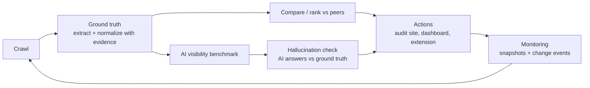

# ProductLens

ProductLens audits how a shirt product page is understood by search and by AI assistants. Every fact it uses points at an exact substring of the page; it is deterministic by default (no GPU, no paid API calls, no composite "score"). Scope: shirts/T-shirts, English and Spanish. Vision: [docs/VISION.md](docs/VISION.md).

The audit loop:

1. **Crawl** a product URL (robots.txt respected; Amazon never fetched) or take a draft listing.
2. **Verified facts**: extract and normalize attributes with evidence.
3. **Listing-quality rank** among comparable shirts (formula shown; not an AI or search rank), with the **3 fixes** to make first.
4. **Generate Fix**: grounded title/description/JSON-LD candidates, scored by a reward and filtered by a hard guardrail.
5. **AI comparison**: merchant original vs optimizer vs AI models on title, tags and description.
6. **AI-visibility benchmark**: do AI models mention and cite the product for realistic shopping prompts.
7. **Hallucination check**: AI claims vs verified facts.
8. **Monitoring**: scheduled crawls, snapshots, diffs, trends, and a grounded merchant chat.
9. **Webhooks** for change events, and **governance** (action policy, approvals, append-only audit log).

## Architecture



Stage-by-stage mapping to code: [docs/ARCHITECTURE.md](docs/ARCHITECTURE.md).

| Path | What |
|---|---|
| `web/` | Shirt audit site served at `/` (React + TypeScript + Vite): paste a URL or draft listing, get a listing-quality rank among comparable shirts (formula shown; not an AI or search rank), top 3 fixes, side-by-side peers, facts with evidence, price position, monitoring; EN/ES; bulk audit of up to 20 URLs with CSV export; Models page (`#/models`, `GET /v1/model-comparison` reads `PRODUCTLENS_COMPARISON`, default `train/runs/comparison.json`; empty state until the run lands) |
| `api/` | FastAPI service: `POST /v1/audit`, extraction, dashboard, monitoring and governance routes, OpenAPI at `/docs` |
| `governance/` | Action policy (`auto` / `approve` / `forbidden`, each with an owner), append-only audit log, approvals ([docs/GOVERNANCE.md](docs/GOVERNANCE.md)) |
| `dataset/` | Collectors (live fetch, WDC, Amazon Reviews 2023), normalization rules, ground-truth build ([spec](docs/DATASET_SPEC.md), [README](dataset/README.md)) |
| `analysis/` | Peer comparison and gap issues (no LLM) |
| `signals/` | Review and price signals |
| `benchmark/` | AI-visibility benchmark harness |
| `monitor/` | Scheduled crawls, snapshots, change events |
| `webhooks/` | Outgoing merchant webhooks: signed, retried, SSRF-checked deliveries (`/v1/webhooks`, [docs/WEBHOOKS.md](docs/WEBHOOKS.md)) |
| `dashboard/`, `extension/` | Analyst dashboard (served at `/dashboard/`) and MV3 Chrome popup |
| `train/` | Optional Qwen2.5-0.5B / 1.5B QLoRA extractors (GPU; not needed to run the demo; [train/README.md](train/README.md)) |

## Quickstart

Docker (one command; audit site at http://127.0.0.1:8000/, dashboard at `/dashboard/`, API docs at `/docs`):

```sh
docker compose up --build
```

Without Docker (Python 3.12+; creates `.venv`, installs `api/requirements.txt`, runs the tests, starts the API on :8000):

```sh
./run.sh              # macOS/Linux/Git Bash
.\run.ps1             # Windows PowerShell
./run.sh --skip-tests # start faster
```

Demo with bundled fixtures (no downloads, no keys):

```sh
tools/demo_data.sh   # then open http://127.0.0.1:8000/dashboard/
```

Configuration: copy `.env.example` to `.env` and uncomment what you need. `run.sh`/`run.ps1` load it; `docker compose` reads it for variable substitution. Dashboard data paths (`PRODUCTLENS_DATA`, `PRODUCTLENS_SIGNALS`, `PRODUCTLENS_VISIBILITY`, `PRODUCTLENS_EVAL`) are optional; missing files give empty states. Never commit `.env`.

The audit site at `/` needs the `web/` build: Docker builds it; `run.sh`/`run.ps1` build it when `npm` is available (else `cd web && npm ci && npm run build`; dev server: `npm run dev`, proxies `/v1` to :8000). Without it the API and `/dashboard/` still work.

Environment variables (all optional; see `.env.example`):

| Variable | Purpose |
|---|---|
| `PRODUCTLENS_DATA`, `PRODUCTLENS_SIGNALS`, `PRODUCTLENS_VISIBILITY`, `PRODUCTLENS_EVAL` | Dashboard/audit data files (dataset JSONL, signals, benchmark report, extraction eval) |
| `PRODUCTLENS_COMPARISON` | Model comparison JSON for `#/models` (default `train/runs/comparison.json`) |
| `PRODUCTLENS_SHOOTOUT`, `PRODUCTLENS_SHOOTOUT_SAMPLE` | AI comparison report (else the bundled mock sample) |
| `ANTHROPIC_API_KEY`, `OPENAI_API_KEY`, `QWEN_API_KEY` | Paid/local model access; paid runs also need a spend cap (`--max-usd`, `BENCHMARK_MAX_USD`) |
| `MONITOR_ENABLED`, `MONITOR_DB`, `MONITOR_DELAY` | Scheduler and snapshot store |
| `GOVERNANCE_DB`, `GOVERNANCE_TOKEN`, `GOVERNANCE_ADMIN_TOKEN` | Audit log; enables `POST /v1/approvals`; admin view of the full log |
| `CHAT_TOKEN`, `CHAT_LLM` | Require a token on `/v1/chat`; chat backend (`stub` default) |
| `OPTIMIZER_BACKEND`, `OPTIMIZER_MODEL`, `OPTIMIZER_CANDIDATES` | Generate Fix backend (`stub` default) |
| `WEBHOOKS_DB` | Webhook store (default `webhooks/data/webhooks.db`) |
| `MODEL_BACKEND`, `QWEN_ADAPTER_PATH` | Optional Qwen extraction fallback |

URL audits read product facts from JSON-LD (parsed leniently: comments/CDATA, trailing commas, several objects, `@graph`), else from microdata, `og:`/`product:` meta tags or hidden `js-product-markup-*` spans; those fallbacks don't count as Product schema. Amazon URLs are never fetched. Pages we can't read return a coded `detail`: `amazon_not_supported`, `blocked_by_store` (401/403, bot check), `page_not_found` (404/410), `product_gone` (redirect to home/search), `not_a_web_page` (PDF/image), `host_not_found`, `not_a_product_page`. A blocked or product-less Shopify `/products/` page falls back to its public `.json`.

Optional model backend: `MODEL_BACKEND=qwen` with `pip install -r api/requirements-qwen.txt` and a LoRA adapter at `QWEN_ADAPTER_PATH` (base Qwen2.5-1.5B-Instruct; 4-bit on CUDA, else CPU). Rule facts with evidence stay primary; the model only fills fields the rules left null, returned separately as `predicted` with `model_status`, and falls back to rules on any error. The Docker image is rules-only.

## API routes

All under `/v1` (OpenAPI at `/docs` and `/openapi.json`). `X-Manage-Token` is returned once by `POST /v1/enroll` and scopes a caller to their own monitored products (comma-separate several).

| Group | Routes | Auth |
|---|---|---|
| Core | `GET /health`, `POST /extract`, `POST /audit` (`{url}`, `{html}`/`{text}` or draft `{title, text, price?, currency?, language?}`), `GET /model-comparison` | none |
| Dataset/dashboard | `GET /products?q=`, `/products/{id}`, `/products/{id}/gaps`, `/products/{id}/signals`, `/products/{id}/competitors`, `/stats`, `/eval`, `/visibility`, `/languages` | none |
| Monitoring | `GET /plans`, `POST /enroll` | none (enroll returns the manage token) |
| | `GET /monitored`, `DELETE /enroll/{public_id}`, `POST /monitored/{public_id}/crawl`, `GET /products/{public_id}/history`, `/snapshots`, `/snapshots/{a}/diff/{b}`, `/trends` | `X-Manage-Token` |
| Chat | `POST /chat` | `token` in body when `CHAT_TOKEN` is set; `X-Manage-Token` for a monitored product |
| Generate Fix | `POST /optimize` | none |
| | `POST /optimize/publish` | Merchant approval (`publish_suggestions`, `approval_id`) |
| AI comparison | `GET /shootout` | none |
| Experiments | `POST /experiments`, `GET /experiments/{id}`, `POST /experiments/{id}/results` | none |
| Webhooks | `GET /webhooks/events` | none |
| | `POST /webhooks`, `GET /webhooks`, `DELETE /webhooks/{id}`, `POST /webhooks/{id}/test`, `GET /webhooks/{id}/deliveries` | `X-Manage-Token` |
| Governance | `GET /governance/policy` | none |
| | `GET /audit-log`, `GET /approvals` | `X-Manage-Token` (own products) or `X-Governance-Admin-Token` = `GOVERNANCE_ADMIN_TOKEN` |
| | `POST /approvals` | `X-Governance-Token` = `GOVERNANCE_TOKEN` (503 if unset) |
| | `POST /predictions/confirm` | optional `X-Manage-Token` (tenant-scoped when it owns the product) |

Governance, optimizer, experiments, chat, shootout and webhooks routers are mounted only when their packages import. The audit site is served at `/` and the dashboard at `/dashboard/`.

## Chrome extension

`extension/` is an MV3 popup (no build). In `chrome://extensions` enable Developer mode, click **Load unpacked**, pick `extension/`, start the API on `http://localhost:8000`, then click **Audit this product** on a product page. If the store blocks the fetch or the page is on Amazon, **Audit as draft** sends only the visible title/description from your own tab, and only on click. Details: [extension/README.md](extension/README.md).

## Tests

```sh
python -m unittest discover -s analysis/tests -t .
python -m unittest discover -s benchmark/tests -t .
python -m unittest discover -s signals/tests -t .
python -m unittest discover -s dataset/tests
python -m unittest discover -s api/tests
```

`run.sh` runs all five before starting the server. Tests use local fixtures and the `mock` model; they make no network or paid calls.

## AI-visibility benchmark (spend-capped)

```sh
# free: mock model
python -m benchmark.harness run --prompts benchmark/examples/prompts.example.jsonl \
  --models mock:mock-1 --catalog benchmark/examples/catalog.example.jsonl --out runs.jsonl
python -m benchmark.harness report --results runs.jsonl \
  --catalog benchmark/examples/catalog.example.jsonl --out-dir benchmark/reports/

# paid: always --dry-run first, then cap spend
python -m benchmark.harness run ... --models anthropic:<model> --dry-run
python -m benchmark.harness run ... --models anthropic:<model> --max-usd 5
```

- Keys come only from `ANTHROPIC_API_KEY` / `OPENAI_API_KEY`. Paid runs require `--max-usd` and a price in `benchmark/prices.json`; the harness stops at the cap.
- Local models: `qwen:<model>` against an OpenAI-compatible server at `QWEN_BASE_URL` (default Ollama).
- Prompt set: `benchmark/prompts/tshirts.jsonl` (120 brand-free intents, EN US/GB and ES ES/MX, seeded 60/20/20 split). `benchmark/prompts/hidden.jsonl` is the held-out split; optimizers must never read it.
- Scheduled weekly visibility (`MONITOR_ENABLED=1`) runs only when a key and `BENCHMARK_MAX_USD` are both set; otherwise it logs `skipped`.
- Hallucination check (`benchmark/claims.py`): `report` parses the sentences around each matched product with the `normalize.py` rules and labels each attribute claim SUPPORTED / CONTRADICTED / UNVERIFIABLE against that product's non-null ground truth. Per model/language it reports claim accuracy = supported/(supported+contradicted), hallucination rate = contradicted/(supported+contradicted), the unverifiable share (never counted wrong), and quoted examples with gold evidence.
- Metrics (mention rate, top-k, MRR, citation rate, stability) describe observed outputs of black-box systems, not their internals.
- AI comparison (`benchmark/shootout/`, web `#/compare` via "Compare with AI models" on an audit result, `web/src/pages/AiComparison.tsx`, `GET /v1/shootout`): a controlled evaluation, not proof of real-world ranking. Per product, the merchant original, the ProductLens optimizer and AI models each give a title, tags and description from the same verified facts (the optimizer's prompt). Every part goes through the optimizer guardrail (anything unsupported disqualifies that generator from the ranking) and a deterministic audit (title: length, brand/type/material/fit; tags: fact and intent relevance, duplicates, language; description: fact and intent coverage, readability, JSON-LD). Each candidate is then the target page in a simulated context with its 4 competitors' real pages; dev/val prompts only, judged by OpenAI and Anthropic models (one held out), with mention rate, top-3 and MRR from `benchmark.match`/`metrics` and bootstrap CIs. The report gives per-part winners and a recommended title/tags/description built only from passing parts. With no run, the API serves `sample_report.json` (mock judges, marked as a sample). Always `--dry-run` first:
  `python -m benchmark.shootout.run --catalog benchmark/demo/demo_catalog.jsonl --data dataset/output/final --dry-run`, then the same with `--max-usd 3` instead of `--dry-run` (keys from the environment).
- `benchmark/metrics.py` also provides `competitor_win_rate(records, products, a, b)` (CWR: share of responses mentioning A or B where A ranks first), `language_visibility_gap(...)` (LVG = V_EN − V_ES per model/product) and `claim_accuracy_passthrough(claims_report)`.
- Demo set (`benchmark/demo/demo_catalog.jsonl`): 25 adult short-sleeve T-shirt targets from small/own-brand shops (19 EN, 6 ES: only 23 Spanish shops survive the filters and about half are dead), 4 comparable competitors each from `analysis/peers.py` (same detected language/type; currency approximated from country TLD), and 5 untouched controls (3 EN, 2 ES). Amazon, big/licensed brands, marketplaces and resellers (a shop titling another brand) are excluded; language is detected from the record text, not the dataset label; long-sleeve, tank, compression and kids items are excluded. Ids, URLs, brand and product names only. Rebuild with `python -m benchmark.demo.build_demo --data <dataset/output/final> --cache <file outside repo>`; each target/control URL got one robots-respecting fetch via `api/safe_fetch.py` and dead ones (404, DNS, robots, 429/503 at check time) were dropped. Baseline run on dev+val prompts only (192 = 96 EN + 96 ES), about 1152 calls, dry-run estimate $2.00:
  `python -m benchmark.harness run --prompts benchmark/prompts/tshirts.jsonl --splits dev,val --models openai:gpt-4o-mini,anthropic:claude-haiku-4-5-20251001 --repeats 3 --catalog benchmark/demo/demo_catalog.jsonl --out benchmark/demo/runs_baseline.jsonl --max-usd 3`, then `python -m benchmark.harness report --results benchmark/demo/runs_baseline.jsonl --catalog benchmark/demo/demo_catalog.jsonl --out-dir benchmark/demo/report_baseline/`.

## Merchant chat

`POST /v1/chat` `{product_id?, message, history?[], token?}` returns `{answer, citations[{type,id,date,merchant_stated}], refused}`. Context comes only from existing stores (monitor snapshots/change events, dataset record, gaps, competitors, signals, benchmark visibility, experiments on the product with their results and computed lift analysis (status, statement, flags, accuracy guardrail) if installed, `CHAT_COMPANY_PROFILE` JSON), picked by product and TF-IDF keywords. Trends are computed in code from >= 2 dated snapshots. The rules are enforced after generation: a sentence is dropped unless it cites known records and each of its numbers equals a numeric value of a cited record (numbers inside dates or ids do not count; a stated unit or currency must match); trend wording must cite a trend or change event; causal claims about rankings or visibility are removed; merchant-stated sources are labelled. If nothing is left, the answer is "I don't have data on that." `CHAT_LLM` can be `stub` (the default, offline), `openai`, `anthropic` (paid, API key needed) or `qwen` (a local OpenAI-compatible server at `CHAT_QWEN_URL`). When `CHAT_TOKEN` is set, requests must include the matching token. When governance is present, each answer's hash is written to the audit log. Code is in `chat/`.

## Competitor intelligence

`python -m analysis.competitor --data records.jsonl --product-id p_123 [--k 5] [--lvg 0.2]` ranks peers with `analysis.peers.similar_peers` (documented weights in `SIM_WEIGHTS`: category, subcategory, price band, attributes, use/style, market TLD+currency, language, title/description cosine via scikit-learn TF-IDF if installed, else token cosine; unknown components are skipped). It prints a table (attributes present, JSON-LD fields, verified facts, Spanish content none/partial/full, independent evidence or "not measured", entity consistency %, contradictions) versus the peer median and top peers, plus issues labelled OBSERVED_FACT / SUPPORTED_HYPOTHESIS / UNKNOWN. Spanish coverage is compared only with peers in the target's page language (a peer counts as Spanish only through its own Spanish page or Spanish text). The Spanish-coverage hypothesis is SUPPORTED only when a measured `--lvg` > 0 is given; otherwise it is UNKNOWN. Issues are measurable differences associated with the observed visibility gap, not causes.

## Experiments (intervention lift)

`POST /v1/experiments` records an intervention (`EXP-000001`, ...): product, language, market, problem, intervention, before/after snapshot refs, optimization and holdout models. Control products are auto-picked with `analysis/peers.py` from `EXPERIMENTS_CATALOG` (else `PRODUCTLENS_DATA`), excluding `changed_products`. `POST /v1/experiments/{id}/results` appends one benchmark `report.json` per run (`phase` baseline/post, `split` dev/hidden) or an accuracy value (`phase` before/after). `GET /v1/experiments/{id}` returns the analysis: adjusted lift = treatment change - control change (pp) with a bootstrap CI over runs, a dev-vs-hidden overfitting flag, holdout-model generalization, and an accuracy guardrail (rejected if any accuracy_after < accuracy_before; sticky, so a new experiment is needed; "unverified" while accuracy is unknown). Reports must carry per-language product rows (`models[*].languages[lang].products`), else they are refused with 422; `build_report` writes them. `report.json` also has `product_rows` (model x product x language x split: mention_rate, top-k rate, MRR, citation_rate, runs) and `lvg` (V_EN − V_ES mention rate per model/product). With no control products only the raw change is reported. Wording is "Observed adjusted visibility lift: +X pp", an observational comparison, not a causal claim. Store: SQLite at `EXPERIMENTS_DB` (append-only). Export the intervention dataset with `python -m experiments export rows.jsonl`.

## Model results

Attribute extraction on 200 fixed test products from 63 stores (`train/runs/comparison.json`, generated 2026-09-30; git-ignored, shown at `#/models`). Scores are exact match per field: non-null = gold has a value, null = gold is empty.

| Model | JSON valid | Non-null acc | Null acc | n |
|---|---|---|---|---|
| All-null baseline | 1.000 | 0.000 | 1.000 | 200 |
| Qwen2.5-0.5B, no fine-tuning | 0.950 | 0.047 | 0.494 | 200 |
| GPT-4.1 (API) | 1.000 | 0.272 | 0.749 | 200 |
| Claude Sonnet 5.5 (API) | 0.989 | 0.081 | 0.713 | 87 (partial) |
| ProductLens fine-tuned Qwen2.5-0.5B | 0.985 | 0.847 | 0.951 | 200 |
| Fine-tuned 0.5B, v2 data | 0.990 | 0.858 | 0.938 | 200 |
| Fine-tuned Qwen2.5-1.5B (v1, 16k data) | 0.995 | 0.812 | 0.985 | 200 |

Caveats: exact-match scoring on the ProductLens label vocabulary favours the fine-tuned models; API models saw the format only in the prompt, so this is not a general quality ranking. Claude Sonnet ran on 87 of 200 records only. The 1.5B v1 was trained without the 7 newer fields and scores about 0 on them by construction. Local models: greedy decoding, 4-bit NF4, RTX 3080 8GB.

Other results appear only when their files exist locally: `train/runs/eval.json` (`GET /v1/eval`), `benchmark/reports/report.json` (`GET /v1/visibility`), `dataset/output/final/stats.json`. Files under `api/tests/fixtures/` are fixtures, not results.

## Data provenance and licensing

The code is MIT-licensed ([LICENSE](LICENSE)). Datasets are not redistributed in this repo (`dataset/output/` is git-ignored) and are for research use only.

| Source | Use | Terms |
|---|---|---|
| Live product pages (`dataset/collect/fetch.py`, `monitor/`) | Crawl and audit | robots.txt respected (never bypassed), Amazon pages never fetched, 1 req/s per host, identifying User-Agent, no challenge bypass; page content stays with its owner |
| [Web Data Commons schema.org Product, 2024-12](https://data.dws.informatik.uni-mannheim.de/structureddata/2024-12/quads/classspecific/Product/) (Common Crawl, Oct 2024) | Training/eval records | Research use; underlying pages remain their owners' content |
| [Amazon Reviews 2023](https://amazon-reviews-2023.github.io/) (McAuley Lab) | Training volume, review signals (offline dump; amazon.com is not crawled) | License not declared: research-only; every row carries `provenance.license = "undeclared-research-only"` so it can be excluded |
| ECB reference rates, BLS CPI-U | USD-2026 price normalization | Public statistics; sources in `signals/reference.py` |
| `Qwen/Qwen2.5-0.5B-Instruct`, `Qwen/Qwen2.5-1.5B-Instruct` (optional) | Extraction fallback | Apache-2.0 per its model card |

Do not use the collected data commercially without checking each source's terms. No third-party code is copied into this repo (dependencies are installed from `requirements.txt` files), so there is no THIRD_PARTY_NOTICES.md; add one if code is copied later.

## Known limitations

- Shirts/T-shirts only (EN/ES).
- Currency is often missing (Amazon Reviews 2023 metadata has none; the demo catalog approximates it from the country TLD), so price comparisons are approximate.
- Pages that render product data only with JavaScript (no JSON-LD, microdata or meta tags in the HTML) cannot be audited from a URL; use a draft audit.
- The Generate Fix guardrail is strict and can reject harmless paraphrases; a merchant reviews every suggestion.
- Open follow-ups (#95): `prose()` ranking of one-word-per-line keyword lists; material mentions should count only when they match the verified material; one missing markup status should not drop markup scoring for everyone; webhook secrets are stored in plaintext (restrict `WEBHOOKS_DB` permissions or encrypt); webhook delivery runs inside the crawl (move to a background worker).
- No billing in the pilot; Google Search Console and SERP APIs are deferred.

## Governance

Every action is `auto`, `approve` or `forbidden` with a named owner (account owner, merchant, ProductLens operator); decisions go to an append-only audit log (`GOVERNANCE_DB`). Paid benchmark runs need a key and a spend cap; optimizers never read the hidden prompt split. Full policy: [docs/GOVERNANCE.md](docs/GOVERNANCE.md). Task board and decisions: `coordination/`.

## Webhooks

`POST /v1/webhooks` `{product_id, url, events[]}` with the product's `X-Manage-Token` registers a public http(s) endpoint for `audit.completed`, `product.changed`, `snapshot.created`, `visibility.changed`, `experiment.result` and `optimizer.suggestion_ready`; the signing secret is returned once. Deliveries are HMAC-SHA256 signed (`X-ProductLens-Signature: t=…,v1=…`), retried with backoff (5 attempts, then dead-lettered) and never carry emails. Details, the verification snippet and the list/delete/test/deliveries routes: [docs/WEBHOOKS.md](docs/WEBHOOKS.md).

## Generate Fix (optimizer)

`POST /v1/optimize` with `{"product": <audited normalized record>, "language": "en"|"es", "gaps"?: <analysis.gaps output>, "peers"?: [...]}` returns a draft: a factual title and description, `missing_attributes` to ask the merchant for, and schema.org Product/Offer `json_ld`. Only fields with evidence count as Product Truth; they are rendered as localized fact sentences, and the model rewrites only those (marketing text is never translated). Every sentence is checked with `benchmark/claims.py`, and an allowlist in `optimizer/guard.py` requires every word and number to come from the verified facts or a small neutral EN/ES vocabulary. The backend writes N candidates (`candidates` in the request, else `OPTIMIZER_CANDIDATES`, default 3, max 5). Each one is scored with `copy_reward` in `train/reward.py`, which combines format, grounding, a hallucination penalty and attribute coverage. The guardrail is a hard filter: a candidate with a flagged sentence can never win. The best-scoring grounded candidate is returned, and `candidates` lists every candidate with its reward breakdown. Each winner-vs-lower-scoring pair is appended to `optimizer/data/pairs.jsonl` (gitignored; set `OPTIMIZER_PAIRS_LOG` to another path, or to empty to turn logging off). These pairs hold product facts only and are meant as future DPO chosen/rejected data. If no candidate passes, a new round is generated, up to 2 more rounds. After that, unsupported sentences are removed. If nothing survives, a template built from the facts is used. With fewer than 2 verified facts the endpoint returns 422 "not enough verified facts". The response reports `accuracy_before` and `accuracy_after`, and `accuracy_after` must be at least `accuracy_before`. `POST /v1/optimize/publish` re-checks the suggestion and needs Merchant approval (`publish_suggestions`). It never writes to a storefront. Backend: `OPTIMIZER_BACKEND=stub` (default, no model), `openai` (`gpt-4o-mini`), `anthropic` or `qwen`, with `OPTIMIZER_MODEL` to override the model. The guard is strict and rule-based. It can reject harmless paraphrases, and a merchant still reviews every suggestion.

## Checks and merging

CI (`ci / check`) runs `dataset/tests`, compiles `train/`, and runs `api/tests`. PR only: `main` requires the `check` status and 1 approval (repo admins can bypass the approval on PR merge). Every merge also needs independent review, updated docs, and explicit human approval of the exact revision.

## Team and credits

Built by [1n1t6sh3ll](https://github.com/1n1t6Sh3ll) with AI coding agents (Claude, Codex) working through a shared task board with independent review. Thanks to the Web Data Commons team (University of Mannheim), Common Crawl, the McAuley Lab (UCSD) for Amazon Reviews 2023, and the Qwen team.
