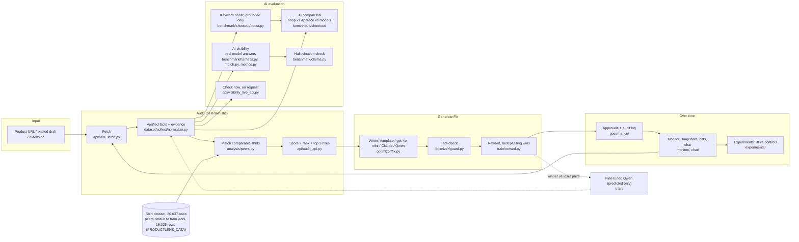
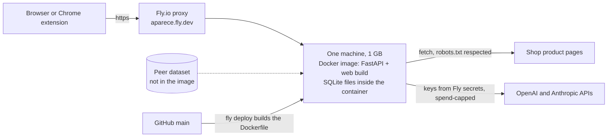

# Aparece architecture

One audit loop that is deterministic by default. Every fact carries evidence: the exact text it came from. Model output is kept separate from rule facts. AI models are used in three places only:
- writing candidate text inside a fact-check;
- acting as the shopping assistants we measure;
- acting as judges in the comparison.

The listing rank itself uses no AI model.

| Stage | Code | What it does |
|---|---|---|
| Fetch | `api/safe_fetch.py`, `api/commoncrawl.py`, `dataset/collect/fetch.py`, `monitor/crawl.py` | http(s) to public IPs only, robots.txt respected (never bypassed), Amazon never fetched, rate limits, size and time caps. Shopify `.json` fallback. When a store blocks a live fetch, `api/commoncrawl.py` reads an archived copy from the public Common Crawl index/WARC files (never the store). Offline sources: WDC, Amazon Reviews 2023. Blocked pages: extension or pasted draft. |
| Verified facts | `dataset/collect/normalize.py`, `api/main.py`, `dataset/build/` | Regex and lookup rules (EN/ES) over JSON-LD, microdata, meta tags and text. Conflicts leave the value empty. The optional Qwen + LoRA only fills empty fields, reported as `predicted`. |
| Matching | `analysis/peers.py`; widening in `api/audit_api.py` → `widen` | Hard filters: product type, language, audience, pack size, sleeve, live link, price band. Candidates are ordered by matching soft facts. With fewer than 10 matches it widens step by step. |
| Score and rank | `api/audit_api.py` → `quality`, `rank`, `shirt_rank` | `60 × facts/22 + 20 × questions answered/9 + 20 × markup/2` (75/25 when markup is unknown). Ties share a position. No AI involved. |
| Fixes | `api/audit_api.py` → `build_actions` | Missing facts (by how many of the top 10 state them), then description, markup, price and language. Each fix carries its evidence and an evidence type. |
| Generate Fix | `optimizer/fix.py`, `optimizer/truth.py`, `optimizer/guard.py`, `train/reward.py` | N candidates from fact sentences only, a fact-check per sentence, a reward, the best passing candidate, then fallback to the fact template. `accuracy_after` ≥ `accuracy_before`. Publishing needs merchant approval. |
| AI visibility | `benchmark/harness.py`, `benchmark/match.py`, `benchmark/metrics.py`, `benchmark/prompts/` | The same shopping prompts (EN/ES; dev/val/hidden split) go to gpt-4o-mini, Claude Haiku or a local Qwen. Answers are matched to catalog shops by URL, alias, or brand and name on one line. Metrics: mention rate, top-k, MRR, citation rate, stability. Paid runs need a key, a price and `--max-usd`. The committed run is in `benchmark/results/visibility-2026-09-30/`, served by `api/dashboard_api.py` → `visibility_summary` to the audit page. |
| Hallucination check | `benchmark/claims.py` | Attribute claims in AI answers are labelled SUPPORTED / CONTRADICTED / UNVERIFIABLE against the verified facts. |
| AI comparison | `benchmark/shootout/run.py`, `score.py`, `report.py`, `live.py`; `api/shootout_api.py` | Shop original vs Aparece (no model) vs Aparece + gpt-4o-mini vs each model alone, all from the same facts. The fact-check gates every part, then title, tag and description scores are computed. The saved run adds a simulated shopping test judged by gpt-4o-mini and Claude Haiku (one held out) with bootstrap intervals. `POST /v1/shootout/live` runs it for any audited product, capped per request and per day, without the shopping test. |
| Keyword boost | `benchmark/shootout/boost.py` | Adds shared shopper keywords (type, material, fit, neckline, sleeve, weight) to a title and description only when the fact-check accepts them as grounded in the page's own facts. It is one of the six writers in the live comparison. |
| Check now | `api/visibility_live_api.py` (`POST /v1/visibility/live`) | On request, asks gpt-4o-mini and Claude Haiku 6 shopping questions each and reports whether the product was named or cited, its best position and the brands named instead. Capped per request (0.05 USD) and per day (1 USD), 3 requests a minute, cached 24 hours; without a key it returns `no_api_key` and simulates nothing. |
| Monitoring and chat | `monitor/`, `chat/`, `api/monitor_api.py`, `api/chat_api.py` | Immutable SQLite snapshots, change events, and the rank computed with the audit's own function. The chat may only cite stored records. |
| Experiments | `experiments/`, `api/experiments_api.py` | Before/after lift against auto-picked control products, a dev vs hidden overfitting flag, and an accuracy guardrail. Built; no real before/after experiment run yet. |
| Governance | `governance/`, `api/governance_api.py` | Every action is `auto`, `approve` or `forbidden`, with an owner; an append-only audit log. Confirming a model prediction needs merchant approval. |
| Training | `train/build_examples.py`, `train/train.py`, `train/eval.py`, `train/api_eval.py`, `train/reward.py` | QLoRA on Qwen2.5-0.5B / 1.5B, and exact-match evaluation against GPT-4.1, Claude and untuned Qwen. Weights: GitHub release `weights-v1`. |
| Web and extension | `web/src/` (React, served at `/`), `extension/` (Chrome MV3) | Audit, comparison, models, monitoring, reports, and a How it works page (`#/docs`), in EN/ES. Dark theme by default (a saved choice wins). |

Serving: FastAPI (`api/main.py`) exposes all `/v1` routes on port 8000 and serves the `web/` build at `/`. The Docker image (`ghcr.io/1n1t6sh3ll/aparece`, built by `.github/workflows/docker.yml`) is rules-only, with no torch.

## Deployment

- **Hosting:** `fly.toml` runs one always-on machine on port 8000 with a `/v1/health` check. The keys (`OPENAI_API_KEY`, `ANTHROPIC_API_KEY`) are Fly secrets, never in git or in the web build.
- **State is not persistent yet.** Stored audits, share links, monitoring, governance and webhooks are SQLite files in the container and are lost on redeploy. A persistent volume and the `*_DB` paths would keep them.
- **Peer data is not in the image.** Without `PRODUCTLENS_DATA` an audit ranks "1 of 1" and lists no fixes.
- **Some shops block cloud servers** (HTTP 429 from datacenter addresses), so a pasted draft is the reliable path on the hosted app.
- The paid routes have no login; they are limited by per-request and per-day caps and a rate limit.
