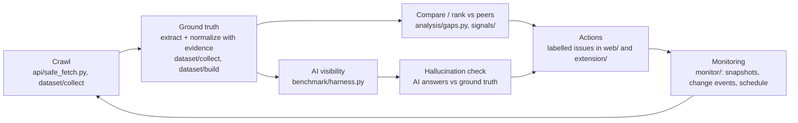

# Aparece architecture

One audit loop, deterministic by default. Every fact carries evidence (an exact substring of the source); model output is kept separate from rule facts.

| Stage | Code | Notes |
|---|---|---|
| Crawl | `api/safe_fetch.py`, `dataset/collect/fetch.py`, `monitor/crawl.py` | http(s), public IPs, robots.txt, rate limits, size/time caps. Offline sources: WDC, Amazon Reviews 2023. |
| Ground truth | `dataset/collect/normalize.py`, `dataset/build/` | Regex/lookup rules (EN/ES); conflicts leave the value null. Optional Qwen+LoRA only fills nulls, reported as `predicted`. |
| Compare / rank | `analysis/`, `signals/` | Up to k comparable peers; issues typed OBSERVED_FACT / SUPPORTED_HYPOTHESIS / UNKNOWN. No composite score, no causal ranking claims. |
| AI visibility | `benchmark/` | Same prompts to mock/Anthropic/OpenAI/local Qwen; mention rate, top-k, MRR, citation rate, stability. Paid runs need a key, a price and `--max-usd`. |
| Hallucination check | `benchmark/match.py`, `benchmark/claims.py` | Mentions are matched to catalog products; attribute claims in AI answers are labelled SUPPORTED / CONTRADICTED / UNVERIFIABLE against non-null ground truth (reusing `normalize.py`), reported in the `claims` section of the benchmark report. |
| Actions | `web/` (audit site at `/`, `api/audit_api.py`), `extension/`, `governance/` | Recommendations labelled by evidence type. |
| Monitoring | `monitor/` | Immutable SQLite snapshots, change events, daily crawl + weekly visibility (skipped without key and spend cap). |

Serving: FastAPI (`api/main.py`) exposes extraction, dashboard, and monitoring routes on port 8000 and serves the `web/` build at `/` (`/dashboard*` redirects there). The Docker image is rules-only (no torch).
