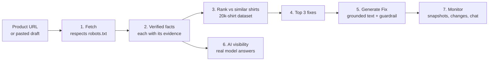

# How ProductLens works

## The idea

Shoppers now ask AI assistants what to buy: "a good black t-shirt that won't fade". The assistant answers from what it can read and trust on product pages. If a small shop's page doesn't state its facts clearly (material, weight, fit, care) in text and markup that machines can read, it doesn't get recommended.

We measured this. We asked gpt-4o-mini and Claude Haiku 384 real shopping questions, half in English and half in Spanish. None of the 103 small shops in our test set was ever named. Big brands were named instead: Everlane in 78 answers, Uniqlo in 74, Patagonia in 59.

ProductLens shows a shop owner what machines can and cannot read on each product page. It compares the page with similar shirts and suggests fixes built only from facts the page already proves. It never invents claims.

## How it helps

| Who | Problem today | What ProductLens gives them |
|---|---|---|
| Small apparel brand (20–500 shirts) | Doesn't know why AI assistants and search skip its products | A rank against similar shirts, the 3 facts to add first, and ready-to-approve text that only states what the page proves |
| Agency managing several stores | Manual audits, and guesswork about what to change | Bulk audits (up to 20 URLs, CSV export), shareable reports, monitoring with change history |
| Seller whose pages can't be fetched (e.g. Amazon) | Tools can't read the listing | Draft audit from pasted text, or the extension auditing the page open in their own browser |
| Anyone publishing product copy | AI writers invent claims ("organic", "pre-shrunk") | A guardrail that rejects any sentence the facts don't support, with the evidence shown |

## One audit, step by step

1. **Fetch.** We download the page once, politely. robots.txt is respected, never bypassed. We identify ourselves as ProductLens and never fetch Amazon directly. If a store blocks us, you can paste the listing text or use the Chrome extension, which reads the page already open in your own browser.
2. **Verified facts.** Rules read the page's structured data (JSON-LD, microdata, meta tags) and its text, in English and Spanish. Every fact (material, weight in gsm, fit, neckline, sleeve, colours, sizes, price) is stored with the exact piece of page text that proves it. If two parts of the page disagree, the value stays empty rather than guessed.
3. **Rank.** The page is scored against comparable shirts from a 20,037-record dataset: same type, language and audience, widened step by step when there are too few matches. The score is how many key facts the page states, plus how many shopper questions the description answers. The formula is shown on the page. This is a listing-quality rank, not a Google or AI ranking.
4. **Top 3 fixes.** For each missing fact that the best-ranked similar shirts do state, you get a concrete fix and the evidence behind it: "8 of the 10 top-ranked similar shirts state their fabric weight."
5. **Generate Fix.** A title and description are written only from your verified facts, as several candidates. Every sentence goes through a guardrail: each word and number must come from your facts or a small neutral vocabulary, so anything unsupported is rejected. The candidates are then scored by a reward (grounding, coverage, no hallucination), and the best one wins. You approve it; nothing is published for you.
6. **AI visibility.** We ask real AI assistants realistic shopping questions and record which shops and brands they name, how high, and whether their claims match the verified facts. The audit shows whether your store was named, and which brands were named instead.
7. **Monitor.** Enrol a product and ProductLens re-checks it on a schedule, keeps snapshots, shows what changed and how the rank moved, and answers questions in a chat that may only cite stored data.

## The models

A small language model was fine-tuned to read product pages into the same fact format. It helps only where the rules left a field empty, and its output is labelled "predicted", never "verified". On 200 test products from 63 stores:

| Model | Facts correct (non-empty fields) |
|---|---|
| ProductLens Qwen2.5-0.5B, fine-tuned (v2) | 85.8% |
| GPT-4.1 (API, prompt only) | 27.2% |
| Qwen2.5-0.5B, untuned | 4.7% |

This is exact-match scoring on our own label format, which favours the fine-tuned model. Weights: the [weights-v1 release](https://github.com/1n1t6Sh3ll/powerlens/releases/tag/weights-v1).

## AI comparison

For 5 products, we compared the shop's original text, ProductLens's text and text written by gpt-4o-mini and Claude Haiku from the same facts. ProductLens won on title, tags and description with no unsupported claims (5 of 5 passed the guardrail), while the AI models' own text had flagged parts. On measured AI visibility the result was a statistical tie. API cost: $0.44.

## What ProductLens will not do

- Bypass robots.txt, bot checks or rate limits, or fetch Amazon pages.
- Invent facts. A missing value stays missing, and a guess is labelled as a prediction.
- Claim that a fix will raise your Google or AI ranking. We report observed differences, not causes.
- Publish anything to your store without your approval.

## Where the code is

| Step | Code |
|---|---|
| Fetch | `api/safe_fetch.py` |
| Verified facts | `dataset/collect/normalize.py`, `api/main.py` |
| Rank and fixes | `api/audit_api.py`, `analysis/` |
| Generate Fix | `optimizer/`, `train/reward.py` |
| AI visibility and comparison | `benchmark/`, `benchmark/shootout/` |
| Monitor and chat | `monitor/`, `chat/` |
| Web app and extension | `web/`, `extension/` |
| Model training | `train/` |

Full technical detail: [REFERENCE.md](REFERENCE.md). Architecture: [ARCHITECTURE.md](ARCHITECTURE.md). Product vision: [VISION.md](VISION.md).
