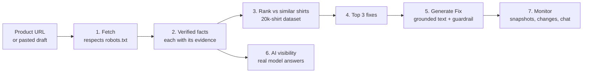

# How Aparece works

## The idea

Shoppers now ask AI assistants what to buy: "a good black t-shirt that won't fade". The assistant answers from what it can read and trust on product pages. If a small shop's page doesn't state its facts clearly (material, weight, fit, care) in text and markup that machines can read, it doesn't get recommended.

We measured this. We asked gpt-4o-mini and Claude Haiku 384 real shopping questions, half in English and half in Spanish. None of the 103 small shops in our test set was ever named. Big brands were named instead: Everlane in 78 answers, Uniqlo in 74, Patagonia in 59.

Aparece shows a shop owner what machines can and cannot read on each product page. It compares the page with similar shirts and suggests fixes built only from facts the page already proves. It never invents claims.

## How it helps

| Who | Problem today | What Aparece gives them |
|---|---|---|
| Small apparel brand (20–500 shirts) | Doesn't know why AI assistants and search skip its products | A rank against similar shirts, the 3 facts to add first, and ready-to-approve text that only states what the page proves |
| Agency managing several stores | Manual audits, and guesswork about what to change | Bulk audits (up to 20 URLs, CSV export), shareable reports, monitoring with change history |
| Seller whose pages can't be fetched (e.g. Amazon) | Tools can't read the listing | Draft audit from pasted text, or the extension auditing the page open in their own browser |
| Anyone publishing product copy | AI writers invent claims ("organic", "pre-shrunk") | A guardrail that rejects any sentence the facts don't support, with the evidence shown |

## One audit, step by step



1. **Fetch.** We download the page once, politely. robots.txt is respected, never bypassed. We identify ourselves as Aparece and never fetch Amazon directly. If a store blocks us, you can paste the listing text or use the Chrome extension, which reads the page already open in your own browser.
2. **Verified facts.** Rules read the page's structured data (JSON-LD, microdata, meta tags) and its text, in English and Spanish. Every fact (material, weight in gsm, fit, neckline, sleeve, colours, sizes, price) is stored with the exact piece of page text that proves it. If two parts of the page disagree, the value stays empty rather than guessed.
3. **Rank.** The page is scored against comparable shirts from a 20,037-record dataset: same type, language and audience, widened step by step when there are too few matches. The score is how many key facts the page states, plus how many shopper questions the description answers. The formula is shown on the page. This is a listing-quality rank, not a Google or AI ranking.
4. **Top 3 fixes.** For each missing fact that the best-ranked similar shirts do state, you get a concrete fix and the evidence behind it: "8 of the 10 top-ranked similar shirts state their fabric weight."
5. **Generate Fix.** A title and description are written only from your verified facts, as several candidates. Every sentence goes through a guardrail: each word and number must come from your facts or a small neutral vocabulary, so anything unsupported is rejected. The candidates are then scored by a reward (grounding, coverage, no hallucination), and the best one wins. You approve it; nothing is published for you.
6. **AI visibility.** We ask real AI assistants realistic shopping questions and record which shops and brands they name, how high, and whether their claims match the verified facts. The audit shows whether your store was named, and which brands were named instead.
7. **Monitor.** Enrol a product and Aparece re-checks it on a schedule, keeps snapshots, shows what changed and how the rank moved, and answers questions in a chat that may only cite stored data.

## The models

A small language model was fine-tuned to read product pages into the same fact format. It helps only where the rules left a field empty, and its output is labelled "predicted", never "verified". On 200 test products from 63 stores:

| Model | Facts correct (non-empty fields) |
|---|---|
| Aparece Qwen2.5-0.5B, fine-tuned (v2) | 85.8% |
| GPT-4.1 (API, prompt only) | 27.2% |
| Qwen2.5-0.5B, untuned | 4.7% |

This is exact-match scoring on our own label format, which favours the fine-tuned model. Weights: the [weights-v1 release](https://github.com/1n1t6Sh3ll/powerlens/releases/tag/weights-v1).

## AI comparison

For 5 products, we compared the shop's original text, Aparece's text and text written by gpt-4o-mini and Claude Haiku from the same facts. Aparece won on title, tags and description with no unsupported claims (5 of 5 passed the guardrail), while the AI models' own text had flagged parts. On measured AI visibility the result was a statistical tie. API cost: $0.44.

## What Aparece will not do

- Bypass robots.txt, bot checks or rate limits, or fetch Amazon pages.
- Invent facts. A missing value stays missing, and a guess is labelled as a prediction.
- Claim that a fix will raise your Google or AI ranking. We report observed differences, not causes.
- Publish anything to your store without your approval.

## Where the code is

| Step | Code |
|---|---|
| Fetch | `api/safe_fetch.py` |
| Verified facts | `dataset/collect/normalize.py`, `api/main.py` |
| Rank and fixes | `api/audit_api.py`, `analysis/` |
| Generate Fix | `optimizer/`, `train/reward.py` |
| AI visibility and comparison | `benchmark/`, `benchmark/shootout/` |
| Monitor and chat | `monitor/`, `chat/` |
| Web app and extension | `web/`, `extension/` |
| Model training | `train/` |

Full technical detail: [REFERENCE.md](REFERENCE.md). Architecture: [ARCHITECTURE.md](ARCHITECTURE.md). Product vision: [VISION.md](VISION.md).

## Technical details (for developers)

The exact rules, formulas and code locations behind each step.

### Every part and its code

| Part | What it does | Code |
|---|---|---|
| Dataset | 20,037 shirts from Common Crawl and Amazon Reviews 2023; every fact keeps the text that proves it | `dataset/collect/`, `dataset/build/make_ground_truth.py` |
| Fetch | Downloads a page politely: respects robots.txt, never fetches Amazon | `api/safe_fetch.py` |
| Verified facts | Rules read the page into facts with evidence (EN/ES) | `dataset/collect/normalize.py`, `api/main.py` |
| Fine-tuned model | Qwen2.5-0.5B fills facts the rules missed, labelled "predicted" | `train/train.py`, `train/eval.py` |
| Matching | Comparable shirts: same type, language, audience, sleeve, price band | `analysis/peers.py` |
| Score and rank | One visible formula for every shirt | `api/audit_api.py` → `quality`, `rank` |
| Top 3 fixes | Missing facts the best similar shirts state, then description, markup, price, language | `api/audit_api.py` → `build_actions` |
| Fact-check | Rejects any word or number the facts don't back | `optimizer/guard.py` |
| Generate Fix | Several candidates from facts only; the reward picks the best one that passes | `optimizer/fix.py`, `train/reward.py` |
| AI comparison | Shop's text vs Aparece vs AI models on title, tags and description | `benchmark/shootout/` (`live.py` for any product) |
| AI visibility | Real AI answers to shopping questions; who gets named | `benchmark/harness.py`, `benchmark/match.py` |
| Monitoring and chat | Re-checks over time; chat cites stored data only | `monitor/`, `chat/` |
| Web app and extension | Site and Chrome extension | `web/src/`, `extension/` |

**1. Matching (which shirts count as comparable).** `analysis/peers.py` keeps a candidate only if it has:
- the same product type, language and audience (adult or kids),
- the same pack size and sleeve length,
- a live link,
- a price in the same band when the currency is known.

Candidates are ordered by how many soft facts match (audience, price band, subcategory, fit, pattern, main material), then by closeness in price. With fewer than 10 matches, `api/audit_api.py` widens the match step by step: first without the price band, then without the sleeve, then any shirt type. The page says which step was used. The product itself is never its own peer.

**2. Scoring (the rank).** Every shirt in one ranking is scored with the same formula:

```
score = 60 × (key facts stated ÷ 22) + 20 × (shopper questions answered ÷ 9) + 20 × (Product/Offer markup ÷ 2)
rank  = 1 + number of comparable shirts with a higher score        (markup unknown → weights 75 / 25)
```

A shopper question counts only if a description sentence answers it and matches a verified fact. Keyword lists don't count. This is a listing-quality rank, not a Google or AI rank.

**3. Recommended fixes (the action plan).** `api/audit_api.py` → `build_actions` compares your page with the 10 best-ranked similar shirts and builds the list in this order:

| Priority | Fix | When it appears | Evidence shown |
|---|---|---|---|
| 1 | Add a missing fact (or make it machine-readable if it's usually visible, like price) | You don't state it but some top shirts do; sorted by how many of the 10 state it | "8 of the 10 top-ranked similar shirts state it" |
| 2 | Describe the product in more detail | Your description is under half the top shirts' median length | Your length vs their median |
| 3 | Add schema.org markup | No Product markup; or no Offer / ProductGroup markup when over half the top shirts have it | How many of them have it |
| 4 | Check your price | Your price is outside the middle half (25th–75th percentile) of comparable listings | The range; not a recommended price |
| 5 | Declare your page language | No `<html lang>` was found | — |

The first 3 are shown as "the 3 fixes to make first". Each one is labelled as an observed fact, never as a promise of better ranking.

**4. How the new title and description are written (Generate Fix).** `optimizer/fix.py` → `generate`:
1. **Facts only.** `optimizer/truth.py` turns the verified facts into short sentences, for example "Material: 95% viscose, 5% elastane." It needs at least 2 facts and a verified brand or product name, or it refuses.
2. **Write N candidates** (default 3, max 5). The writer is the template (no model), gpt-4o-mini, Claude or Qwen (`OPTIMIZER_BACKEND`). It sees only those fact sentences.
3. **Fact-check every sentence** (`optimizer/guard.py`). A sentence is flagged if any word isn't backed by the facts, or any number isn't that field's verified value. Flagged sentences are shown to the writer in the next round, up to 2 more rounds.
4. **Score each candidate** (`train/reward.py` → `copy_reward`):
   ```
   reward = 1 (valid title ≤ 90 chars + description) + 1 × share of sentences that pass − 2 × flagged sentences + 2 × share of verified facts covered
   ```
5. **Pick the winner.** It's the highest reward among candidates with no flagged sentence. A flagged candidate can never win.
6. **Safety net.** Any leftover flagged sentence is removed. If nothing is left, the fact sentences themselves are used as the description. The final text is checked once more and never returned if it fails.
7. **Report before and after.** The response shows `accuracy_before` (your current text) and `accuracy_after` (the suggestion), plus every candidate's reward breakdown. The merchant accepts or dismisses it; nothing is published automatically.

**How the recommended version in the AI comparison is built.** The same fact-check decides who is eligible. Then `benchmark/shootout/report.py` → `merged` takes:
- the winning **title**;
- the winning **description**;
- up to 8 **tags** that pass the fact-check, starting with the winning tag set and adding passing tags from the others, without duplicates.

The page shows which writer each part came from.

**5. Matching AI answers.** For the visibility benchmark, `benchmark/match.py` counts a product as mentioned when its exact URL appears, one of its aliases appears, or its brand and name appear on the same line. The metrics are mention rate, top-3 rate and MRR (average of 1 ÷ position of the first mention).

**6. The AI comparison: how the versions are ranked.** Five writers get the same verified facts (`benchmark/shootout/run.py` → `generate`):
- **Aparece (no AI model)**: text built from templates;
- **Aparece + gpt-4o-mini**: the model writes inside Aparece's fact-check and reward;
- **gpt-4o-mini alone** and **claude-haiku-4-5 alone**;
- **the shop's original text**.

Each part is then scored as follows. `score.py` is `benchmark/shootout/score.py`, and `report.py` is `benchmark/shootout/report.py`.

| Step | Formula | Code |
|---|---|---|
| Fact-check (gate) | A part is **eligible** only if no sentence has an unbacked word or a wrong number | `optimizer/guard.py` → `check_sentence`, `_number_problems` |
| Title score | (brand in title + product type + material + fit + length 15–90 chars) ÷ checks that apply | `score.py` → `title_audit` |
| Tags score | mean(fact relevance, intent relevance, language match) × unique tags ÷ tags × passing tags ÷ unique tags | `score.py` → `tags_audit` |
| Description | attribute coverage = facts stated correctly ÷ facts available; intent coverage = shopper questions addressed ÷ questions; readability = Flesch (EN) or Fernández-Huerta (ES) | `score.py` → `attribute_coverage`, `intent_coverage`, `readability` |
| Simulated shopping test (saved run only) | Each description is placed as the target page among its 4 real competitors. Judges (gpt-4o-mini and claude-haiku, one held out) answer shopping questions. Mention rate, top-3 rate and MRR are computed, with 95% bootstrap intervals over (product, question) | `run.py` → `context`; `score.py` → `metrics`, `with_ci` |
| Winner of each part | Among eligible parts: title = highest title score (tie: closest to 60 chars); tags = highest tags score; description = highest MRR, else highest attribute coverage | `report.py` → `part_winners` |
| Recommended version | Winning title + winning description + passing tags merged (up to 8, no duplicates) | `report.py` → `merged` |
| Overall ranking | Generators whose parts pass on every product, sorted by MRR, then mention rate. The leader is **decisive** only if the paired-difference interval against the runner-up is above 0; otherwise it's a tie | `report.py` → `build`; `score.py` → `paired_diff` |
| Live run (any product) | Same generators, fact-check, scores and winners, with no shopping test and no visibility numbers | `benchmark/shootout/live.py` → `compare` |


### How tags work

1. **Making tags.**
   - **Aparece** builds up to 8 tags straight from the verified facts, in this order: product type, materials (largest share first), fit, sleeve, neckline, pattern, audience, colours, weight in gsm. For example: `t-shirt, viscose, elastane, short sleeves, crew neck, for men, black`. See `benchmark/shootout/score.py` → `fact_tags`.
   - **AI models** write their own tags from the same facts.
2. **Checking each tag.** Every tag goes through the same fact-check as a sentence: every word must come from the verified facts, or be the product's own brand or name. A tag like `organic cotton` on a viscose shirt is marked false and crossed out on the page. See `score.py` → `tags_audit`.
3. **Scoring the tag set.**
   ```
   tags score = average(fact relevance, intent relevance, language match) × (unique tags ÷ tags) × (passing tags ÷ unique tags)
   ```
   - **fact relevance** is the share of tags that name a verified fact or the product type.
   - **intent relevance** is the share that match words shoppers use in the benchmark questions.
   - **language match** is the share written in the page's language.
4. **Winner and recommendation.** The tag set with the best score among those with no false tag wins. The recommended tags start with the winner's passing tags, then add passing tags from the other writers, up to 8 with no duplicates. See `report.py` → `part_winners`, `merged`.

### Vision and where it is in the code

The goal ([VISION.md](VISION.md)) is a platform that helps small shops understand, improve and track how search and AI shopping assistants see their products. It runs a loop: **measure → compare → recommend → track → experiment → learn**, where every recommendation is backed by evidence. It answers five questions:

| Vision question | What Aparece does | Code | Status |
|---|---|---|---|
| 1. How does AI or search see my product? | Reads the page into verified facts, each with evidence, plus markup signals | `api/safe_fetch.py`, `dataset/collect/normalize.py`, `api/main.py` | Done |
| 2. Where does my product appear? | Asks real AI assistants shopping questions and measures mention rate, top-3 and MRR | `benchmark/harness.py`, `benchmark/match.py`, `benchmark/metrics.py` | Done (2 models, 384 answers) |
| 3. What information or intents am I missing? | Ranks against comparable shirts; finds the facts and shopper questions the page misses | `analysis/peers.py`, `analysis/gaps.py`, `api/audit_api.py` | Done |
| 4. What truthful changes should I test? | Top 3 fixes, plus fact-checked text written only from verified facts | `api/audit_api.py` → `build_actions`, `optimizer/fix.py`, `optimizer/guard.py` | Done |
| 5. Did the change actually help? | Snapshots and diffs over time; experiments with control products and adjusted lift | `monitor/`, `experiments/`, `api/experiments_api.py` | Built; no real before/after experiment run yet |

The vision's key rules, and where each is enforced:

| Rule | Where |
|---|---|
| Product truth: facts need evidence, nothing is invented | `optimizer/truth.py`, `optimizer/guard.py` |
| No magic score: the formula is shown, and so is every part of it | `api/audit_api.py` → `quality`, `formula` |
| Accuracy guardrail: a change must never make the facts less accurate | `optimizer/fix.py` (`accuracy_before` ≤ `accuracy_after`), `experiments/` |
| Benchmark protection: optimizers never see the hidden question set | `benchmark/prompts/hidden.jsonl`, `benchmark/harness.py` |
| Deterministic first, AI only where it helps | Rules in `dataset/collect/`; the model only fills empty fields (`train/`) |
| Human approval before anything is published | `governance/`, `POST /v1/optimize/publish` |
| Multilingual (EN/ES) | Rules, fact sentences, questions and the UI all in both languages |

Scope choice: the vision says to start with one category. We chose shirts and T-shirts.

### Human in the loop (fine-tuning)

People stay in control at every step, and their decisions are recorded as training signal:

| Step | What the human does | Where it's stored | Code |
|---|---|---|---|
| Label check | Reviews a diverse sample of dataset labels | `dataset/output/final/human_review.csv` | `dataset/build/make_ground_truth.py` |
| Model predictions | The model's guesses are shown as "predicted", never "verified"; a merchant confirms a value, which needs approval, before it counts as a fact | Append-only audit log | `governance/hooks.py`, `POST /v1/predictions/confirm` |
| Generate Fix | The merchant accepts or dismisses each suggestion; nothing is published without approval | Merchant profile | `api/profile_api.py` |
| Preference pairs | Each winning candidate vs a lower-scoring one, facts only | `optimizer/data/pairs.jsonl` | `optimizer/fix.py` |

Training so far is supervised fine-tuning on the verified labels (`train/train.py`). Retraining on the pairs and confirmations (best-of-N and DPO, scored with `train/reward.py`) is designed but not yet run; see [train/README.md](../train/README.md).
